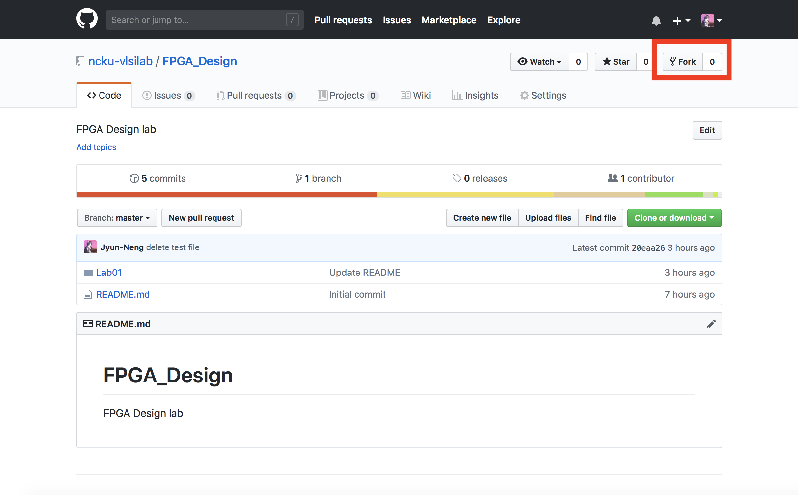

FPGA Design Lab00 - How to Turn in Homework in This Course
=================

## Step 1. Create a GitHub account

## Step 2. Download GitHub Desktop
Here's [GithHub Desktop](https://desktop.github.com)
## Step 3. Fork this course repository

## Step 4. Pull Requests
Here's [PR tutorial](https://gitbook.tw/chapters/github/pull-request.html)
