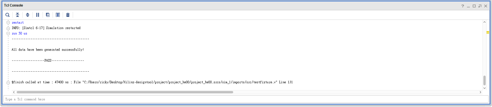
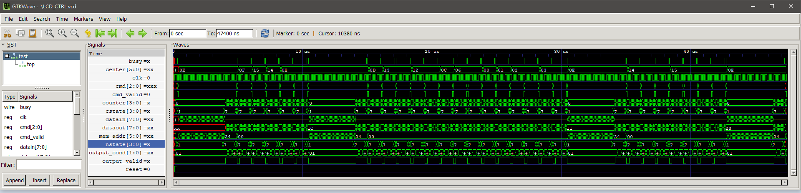
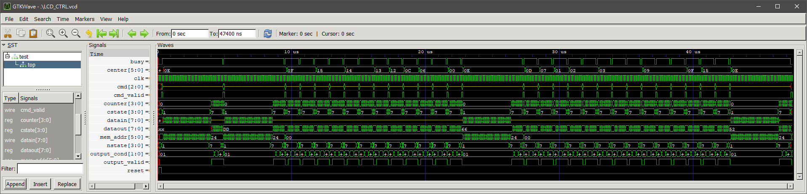

HW00--Image Display Controller
===================
* [Member](#member)
* [Requirement](#rules)
* [Design](#design)
* [File](#file)
* [Simulation](#simulation)
    * [Simulation1](#sim1)
    * [Simulation2](#sim2)

<h2 id="member">Member</h2>

- 三乙 E24056572 楊承燁
- 三乙 E24056637 陳  淳
- 三乙 E24054203 張復凱

<h2 id="rules">Requirement</h2>
請完成一影像顯示控制電路設計。此控制電路，可依指定之操控指令，
使顯示端的影像進行水平及垂直方向的平移(Shift)功能。本控制電路有 5 個信號輸入(cmd，cmd_valid，datain，clk，reset)及3 個信號輸出(dataout，output_valid，busy)

<h2 id="design">Design</h2>

利用FSM來控制時序，分為八個state，以下為其工作:

|  State                   |            Function             
| ------------------------ |-----------------------------------|
|  S_reflash               | reflash the image
|  S_load                  | load data
|  S_shiftright            | shift image right
|  S_shiftleft             | shift image left 
|  S_shiftup               | shift image up
|  S_shiftdown             | shift image down
|  S_wait                  | standby and decode
|  S_Out                   | output state

S_load , S_reflash 以及 S_shift 的四個state負責處理邊界以及計算新的center後由S_out負責輸出，S_wait則是等待以及負責解析輸入的指令。

<h2 id="file">File</h5>

|  folder/file             |            Function                
| ------------------------ |-----------------------------------|
|  src/cmd1.dat            | testing command set 1  
|  src/cmd2.dat            | testing command set 2      
|  src/image1.dat          | testing data set 1 
|  src/image2.dat          | testing data set 2      
|  src/out_golden1.dat     | golden set 1                      
|  src/out_golden2.dat     | golden set 2                      
|  src/out.dat             | testbench output file 
|  src/testfixture.v       | testbench source code             
|  src/lcd_ctrl.v          | **hw00 source code**  

<h2 id="simulation">Simulation Result</h2>

<h3 id="sim1">Simulation1</h3>

模擬結果截圖

模擬波形圖

<h3 id="sim2">Simulation2</h3>

模擬結果截圖

模擬波形圖

