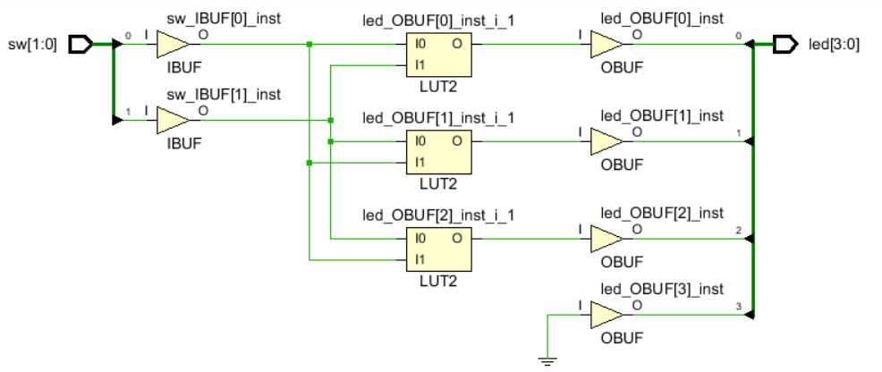

# FPGA-based System Design - Lab01 HW

## 成員名單
E24046357、E24046399、E24042060
## Question1
1、因為一開始在宣告I/O時，LED是宣告4 bits[3:0]，但是在code中卻沒有對LED[3]進行描述，使其空接。
所以Vivado自動將這個PIN腳接地([Synth 8-3917] design LED has port led[3] driven by constant 0)如圖：

2、在操作過程中未出現_"place_design is not in timing mode"_ 的 warning。
## Question2
Implementation的report跑出了"[Power 33-232] No user defined clocks were found in the design!"的warning。
這是因為FPGA在操作時，電路中的記憶體仍需要Clock，因此需要一個Virtual Clock來配合操作，但卻不用將此Clock接至任何的I/O Pin。

## Programming
### 設計描述
我們利用FPGA內建的**Clock的頻率遠大於人類手指的按壓頻率的特性**，將4-bit的LED設計成一個**16面骰子**。
怎麼說呢？首先從四個button的功能說起
[在Clock正緣時觸發]

| btn[0] | btn[1] | btn[2] | btn[3] |
|--|--|--|--|
| Counter+1 | Counter-1 | Counter歸零 | Counter全填1 |

這個4-bit的Counter，每一個都對應到一顆LED。(EX：若Counter為1010，則只有LED[1]、LED[3]會亮，此數代表10。)

而使用者的手指就算只是很短暫的按一下按鈕，這短暫的時間內也經過了無數個Clock Cycles，又因為每一次按壓的時間不會相同，所以這個方法可以視為是**亂數**的實現。

#### 而這個設計也提供了老千功能！

舉例來說，假如今天買大的人比較多，買小的人比較少，那麼莊家就可以假裝按btn[0]、btn[1]，然後使用他的小拇指偷按btn[2]，出來的點數則會是0點；反之，若買小的人較多，則換成按btn[3]即可。這樣莊家就賺翻了！

> Written with [StackEdit](https://stackedit.io/).
