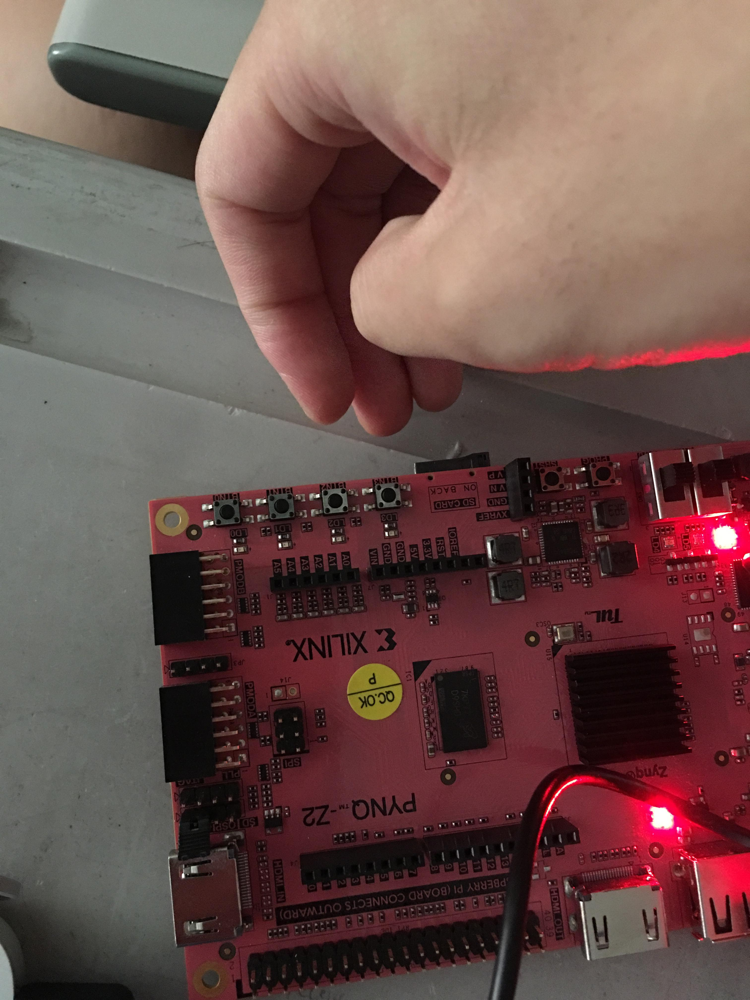
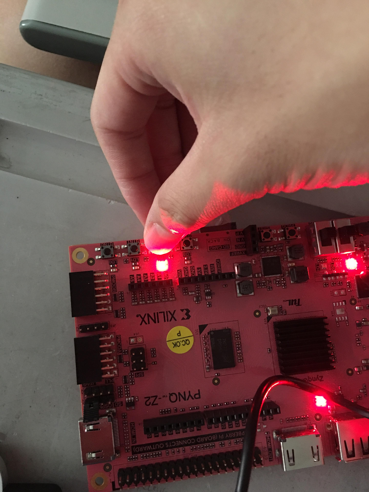
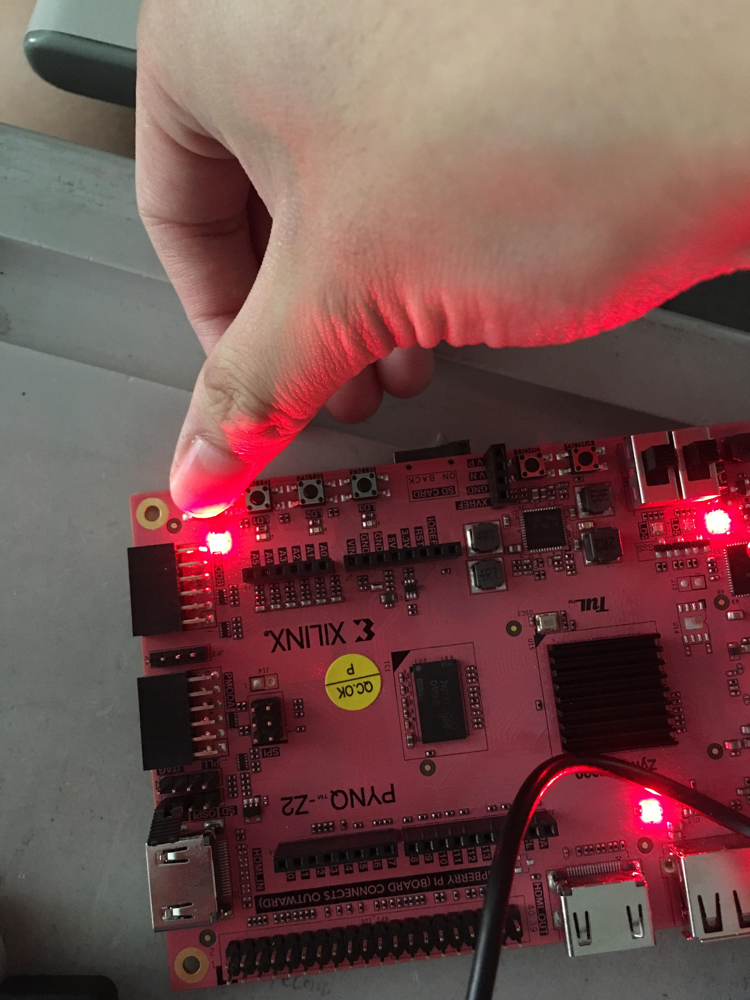
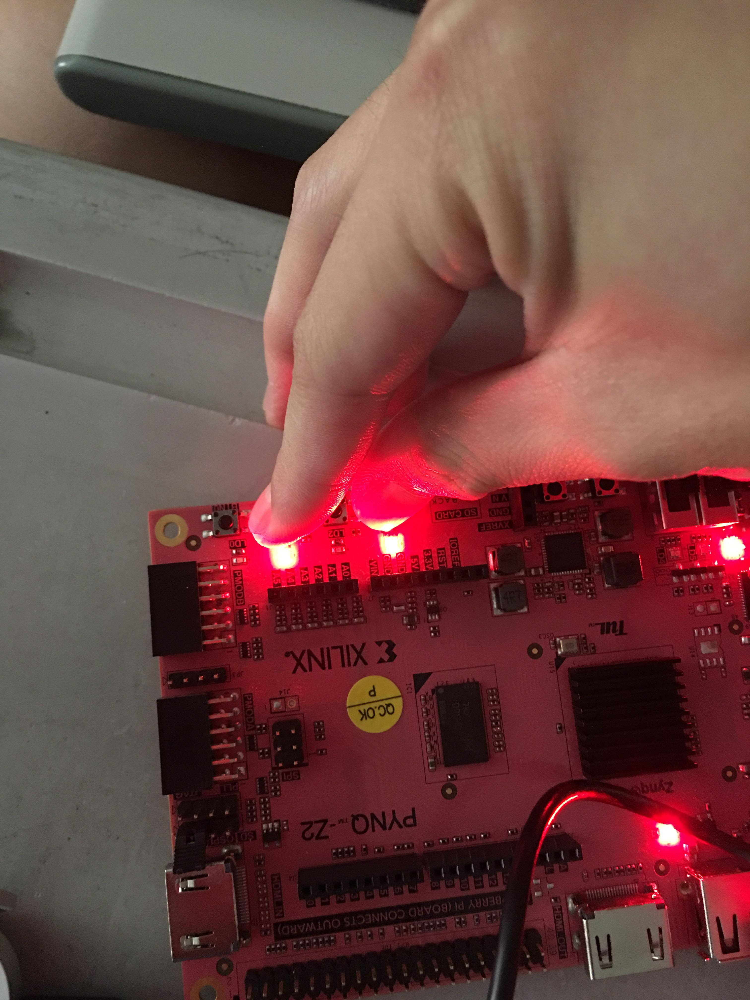

FPGA-based System Design - Lab01 HW
=

* [Member](#Member)
* [Question 1](#Question1)
* [Question 2](#Question2)
* [Programming](#Programming)
* [Result](#Result)

<h2 id="Member">Member</h2>

- E24056572   
- E24056637   
- E24054203   

<h2 id = "Question1">Question 1 </h2>

**Synthesis 產生了一個有關 led[3] 的 warning，此 warning 是什麼意思? 是否會影響 FPGA 呈現的結果?**  
  
一般case中資料會變動，然而此處led[3]恆為常數，因此vivado提出警告，提醒此處程式led[3]以及其他的LED均沒有更動，以免是開發者出錯，搞錯部分case時led的數值。  
在這個LAB裡面這樣的情形並不會影響到實際結果。

**Implementation 產生了 "place_design is not in timing mode" 的 warning，為什麼會產生此 warning?**  
  
以下節錄自Xilinx說明文件

        Ignore User Timing Constraints
        This property controls the use of timing constraints during placement. The primary method of specifying timing requirements is by entering them in the User Constraints File (UCF). For detailed information about timing constraints, see the Constraints Guide.
        If this property is not selected (checkbox is blank), Map packs and places in accordance with any timing constraints specified in the User Constraints File (UCF).
        If this property is selected (checkbox is checked), timing constraints in the UCF are ignored when Map runs. Map will proceed as follows:
        For all devices except Virtex-5, packing and placement will run without timing constraints.

        //

         Timing Mode
        This property is enabled when the Ignore User Timing Constraints property (see above) is selected.

我們推測這與Timing Constraint的設定有關係，只是我們並未在Vivado Design Suite中找到相關的設定。  

<h2 id = "Question2">Question 2</h2>

**本實驗所加入的 Constraints 有個 virCLK.xdc 的檔案，若將此檔案移除在重新做一次本實驗，會有什麼不一樣的地方?**

 Route Design Warning Message   
  
        [Power 33-232] No user defined clocks were found in the design!
        [Timing 38-313] There are no user specified timing constraints. Timing constraints are needed for proper timing analysis.

根據錯誤訊息  

        Resolution: Please specify clocks using create_clock/create_generated_clock for sequential elements. For pure combinatorial circuits, please specify a virtual clock, otherwise the vectorless estimation might be inaccurate

儘管對於組合電路來說clock並不會有影響，在序向電路的情況下還是需要virtual clock來當作約束設定(constraint)的相對值，像是在設置輸入延遲或是輸出延遲的時候就會以virtual clock為參考。  

<h2 id = "Programming">Programming</h2>

**本實驗範例為使用開關來控制 LED，請改用板子上的四個按鈕來控制 LED。**

這個作業我們直接將四個按鈕的狀態與四顆LED燈連結。
- Code LED .sv:

		always_comb begin
            led=btn;
        end

使用到板載的四個按鈕，因此要修改xdc
- Physical Constraints File :
 
        set_property -dict { PACKAGE_PIN D19   IOSTANDARD LVCMOS33 } [get_ports { btn[0] }]; #IO_L4P_T0_35 Sch=btn[0]
        set_property -dict { PACKAGE_PIN D20   IOSTANDARD LVCMOS33 } [get_ports { btn[1] }]; #IO_L4N_T0_35 Sch=btn[1]
        set_property -dict { PACKAGE_PIN L20   IOSTANDARD LVCMOS33 } [get_ports { btn[2] }]; #IO_L9N_T1_DQS_AD3N_35 Sch=btn[2]
        set_property -dict { PACKAGE_PIN L19   IOSTANDARD LVCMOS33 } [get_ports { btn[3] }]; #IO_L9P_T1_DQS_AD3P_35 Sch=btn[3]

<h2 id = "Result">Result</h2>

原始狀態  

按下第三個按鈕  

按下第一個按鈕  

按下第一及第三個按鈕  

