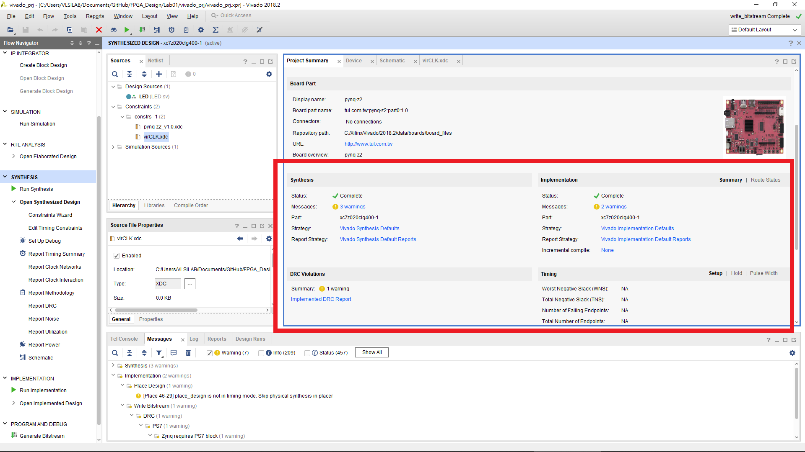

Homework
====
# 繳交時間
2018/10/21 23:59

### Question 1.
執行完 Generate Bitstream 後，Project Summary 會有各個階段的結果如下圖。

請問，  
Synthesis 產生了一個有關 led[3] 的 warning，此 warning 是什麼意思? 是否會影響 FPGA 呈現的結果?  
Implementation 產生了 *"place_design is not in timing mode"* 的 warning，為什麼會產生此 warning?
### Question 2.
本實驗所加入的 Constraints 有個 virCLK.xdc 的檔案，若將此檔案移除在重新做一次本實驗，會有什麼不一樣的地方?
### Programming
本實驗範例為使用開關來控制 LED，請改用板子上的四個按鈕來控制 LED。
