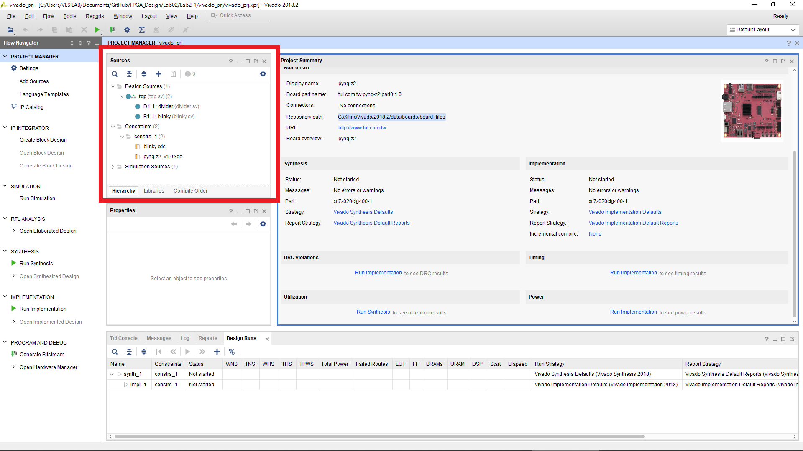

FPGA Design Lab2-1
=================
## Step 1. Create a new project
請回顧 [Lab01 Step1](https://github.com/ncku-vlsilab/FPGA_Design/tree/master/Lab01#step-1-create-a-new-project) 並將要加入的 HDL code 及 constraints 改為 Lab2-1 提供的
`top.sv divider.sv blinky.sv blinky.xdc pynq-z2_v1.0.xdc`  

建立完成後 Sources 欄位應該要有剛加入的檔案如下圖所示。

  
## Step 2. Generate bitstream
請回顧 [Lab01 Step2](https://github.com/ncku-vlsilab/FPGA_Design/tree/master/Lab01#step-2-generate-bitstream)

## Step 3. Program FPGA
請回顧 [Lab01 Step3](https://github.com/ncku-vlsilab/FPGA_Design/tree/master/Lab01#step-3-program-fpga)
