FPGA Design Lab2-2
=================

## Step 1. Create a new project
請回顧 [Lab01 Step1](https://github.com/ncku-vlsilab/FPGA_Design/tree/master/Lab01#step-1-create-a-new-project) 並將要加入的 HDL code 及 constraints 改為 Lab2-2 提供的
`divider.sv divider_ooc.xdc`  

建立完成後 Sources 欄位應該要有剛加入的檔案如下圖所示。

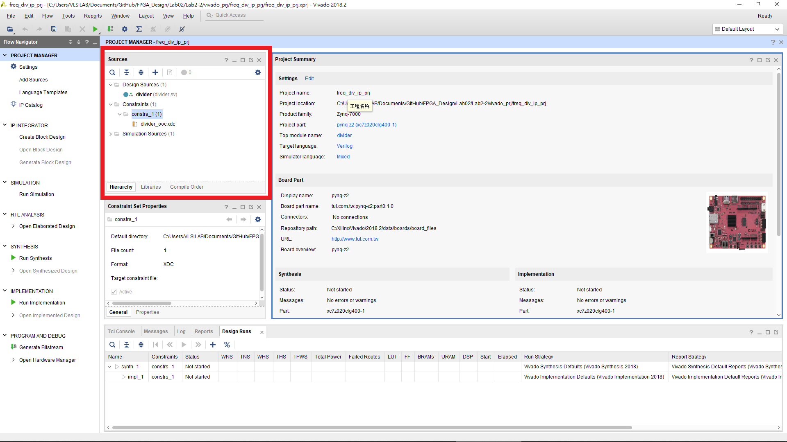

> NOTE: 本次實驗需要執行三次 create project 的動作，前兩次的目的為將 project 包成自製 IP 以供最後一個 project 的 block design 使用。

## Step 2. Out-of-Context XDC files setting

選擇 `divider_ooc.xdc`  
在 Source File Properties 欄位選擇 Properties。  
在 USED_IN 欄位加入 out-of-context。

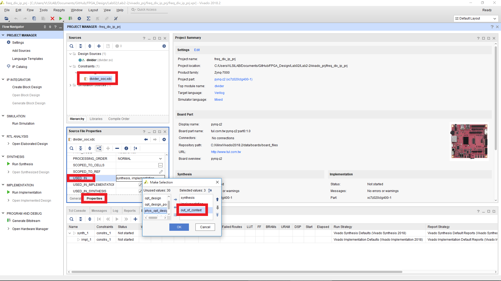

## Step 3. Package the IP
選擇 Tools > Create and Package New IP。

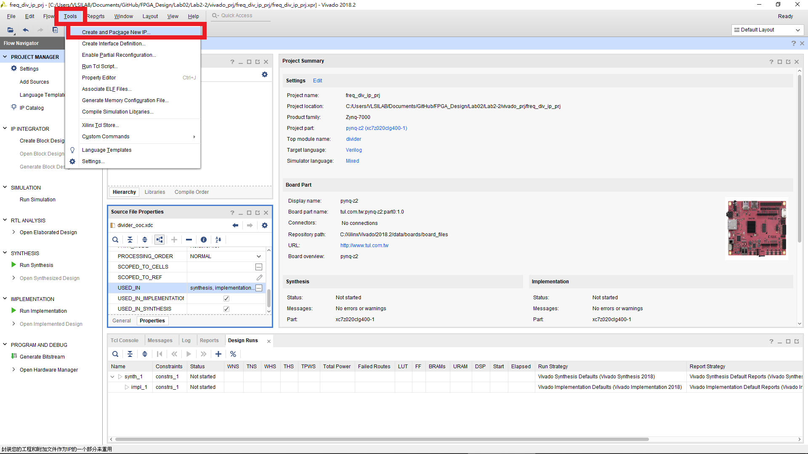

選擇 Package your current project。

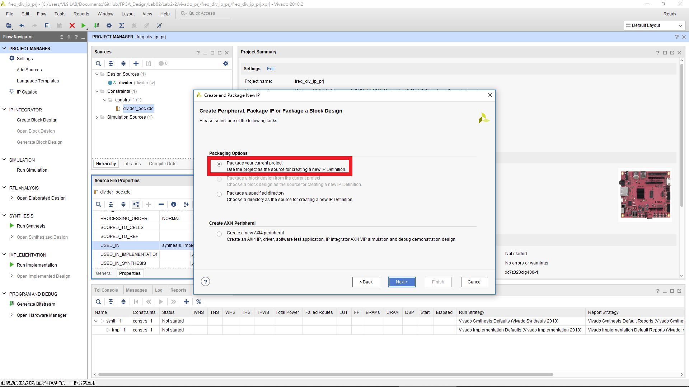

選擇 IP 生成路徑 (範例使用的路徑為 Lab2-1/IP/freq_div)。

完成後會出現下圖介面。

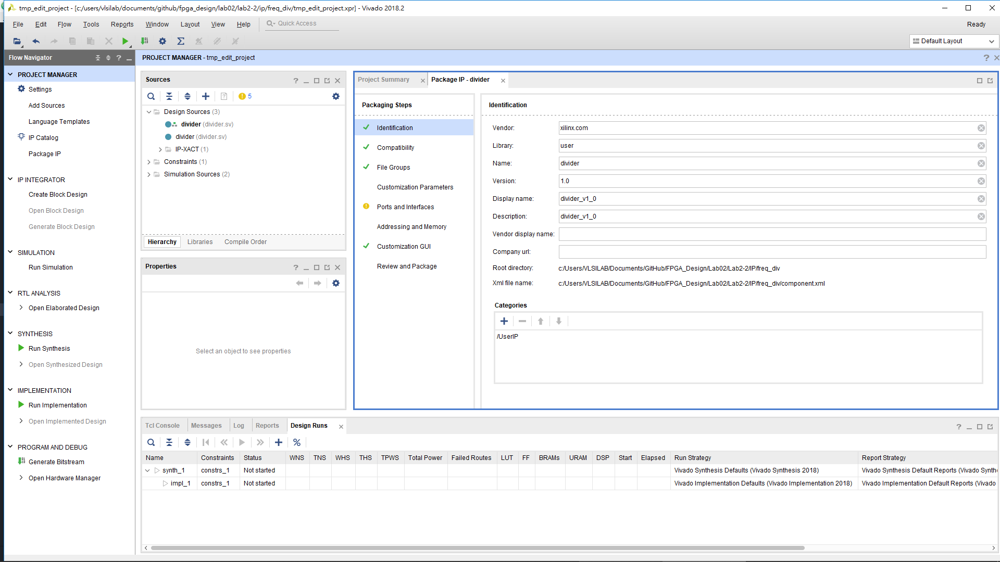

選擇 Packaging Steps 底下的 Ports and Interfaces，右鍵 clk_div 選擇 Add Bus Interface

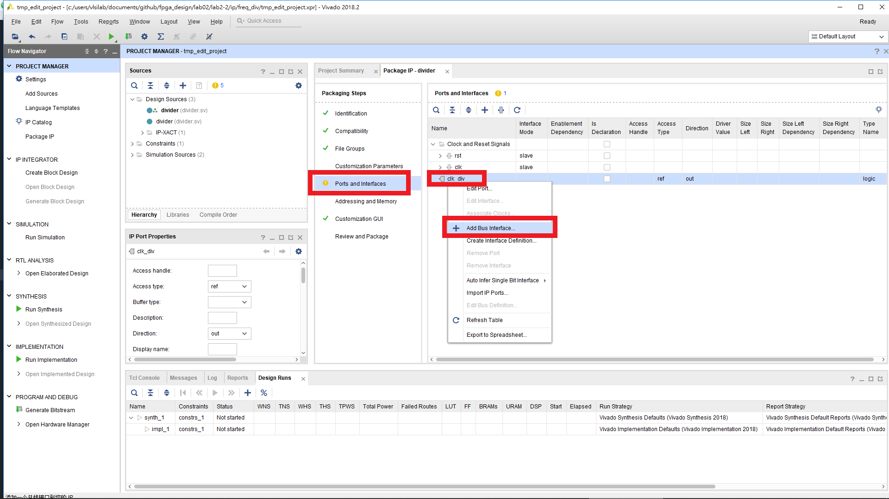

更改 General 底下的 Interface Definition 為 Signal 的 clock_rtl。

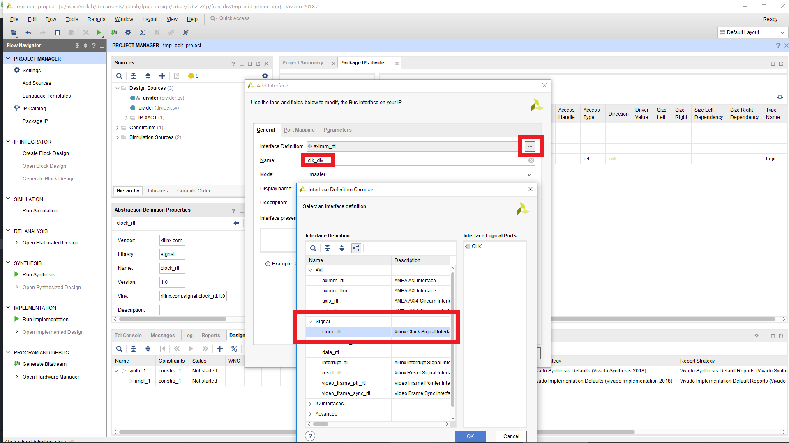

到 Port Mapping 選擇 CLK 以及 clk_div 後按下 Map Ports

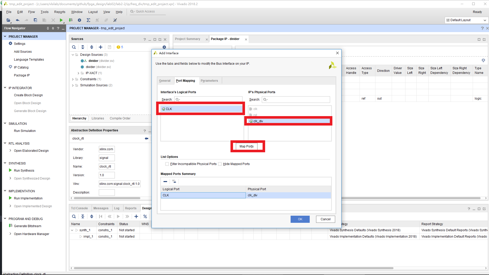

到 Parameters 刪除 FREQ_HZ。

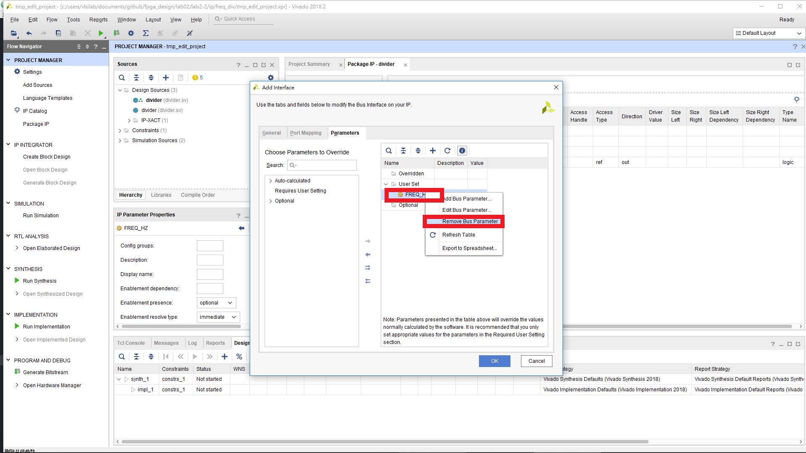

完成後按下 OK。  
編輯 clk (點兩下)，到 Parameters 刪除 ASSOCIATED_RESET。

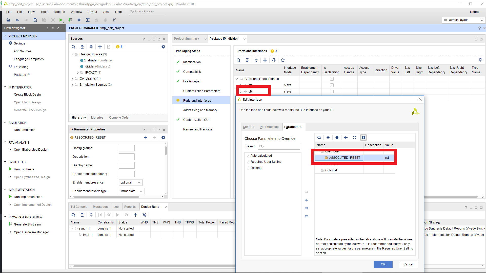

選擇 Packaging Steps 底下的 Review and Package，按下 Package IP。

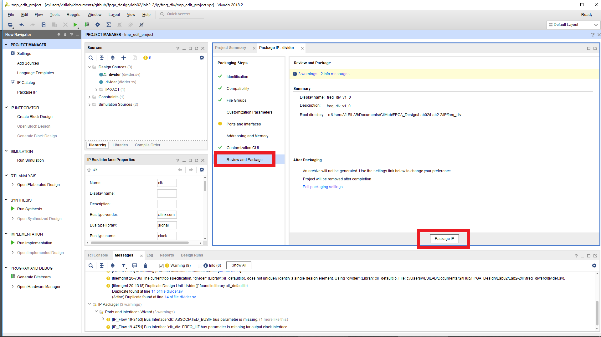
