FPGA Design Lab2-2
=================

## Step 1. Create a new project
請回顧 [Lab01 Step1](https://github.com/ncku-vlsilab/FPGA_Design/tree/master/Lab01#step-1-create-a-new-project) 並將要加入的 HDL code 及 constraints 改為 Lab2-2 提供的
`divider.sv divider_ooc.xdc`  

建立完成後 Sources 欄位應該要有剛加入的檔案如下圖所示。

> NOTE: 本次實驗需要執行三次 create project 的動作，前兩次的目的為將 project 包成自製 IP 以供最後一個 project 的 block design 使用。

## Step 2. Out-of-Context XDC files setting

選擇 `divider_ooc.xdc`  
在 Source File Properties 欄位選擇 Properties。  
在 USED_IN 欄位加入 out-of-context。

## Step 3. Package the frequency divider IP
選擇 Tools > Create and Package New IP。

選擇 Package your current project。

選擇 IP 生成路徑 (範例使用的路徑為 Lab2-1/IP/freq_div)。

完成後會出現下圖介面。

選擇 Packaging Steps 底下的 Ports and Interfaces，右鍵 clk_div 選擇 Add Bus Interface

更改 General 底下的 Interface Definition 為 Signal 的 clock_rtl。

到 Port Mapping 選擇 CLK 以及 clk_div 後按下 Map Ports

到 Parameters 刪除 FREQ_HZ。

完成後按下 OK。  

編輯 clk (點兩下)，到 Parameters 刪除 ASSOCIATED_RESET。

選擇 Packaging Steps 底下的 Review and Package，按下 Package IP。

Frequency divider IP 製作完成，關閉此 project。

## Step 4. Packge the blinky IP

建立新的 project 並將要加入的 HDL code 及 constraints 改為 `blinky.sv blinky_ooc.xdc blinky.xdc`  

在 `blinky_ooc.xdc` 的 USED_IN 欄位加入 out-of-context。

按照 Step3 直到出現 package IP 的介面。

同樣的，選擇 Packaging Steps 底下的 Ports and Interfaces 編輯 clk，到 Parameters 刪除 ASSOCIATED_RESET。

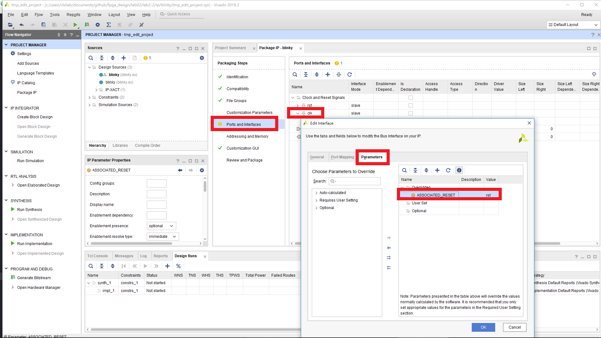

選擇 Packaging Steps 底下的 Review and Package，按下 Package IP。

Blinky IP 製作完成，關閉此 project。

## Step 4. Create a block design project

建立新的 project 且僅需加入 constraints `top.xdc pynq-z2_v1.0.xdc`

建立完成後，需將剛剛所製作的 IP 存放路徑加入到此 project。

開啟 PROJECT MANAGER 底下的 Settings，選擇 IP > Repository 加入剛剛製作的 IP 路徑 (本範例將製作的 IP 存放在 /Lab2-2/IP)。

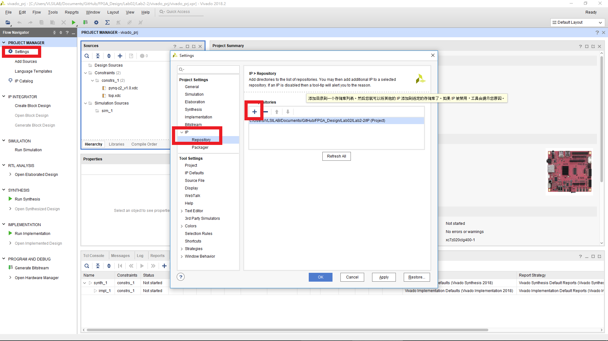

## Step 5. Block design

點選 PROJECT MANAGER 底下的 Create Block Design 會出現下圖介面。

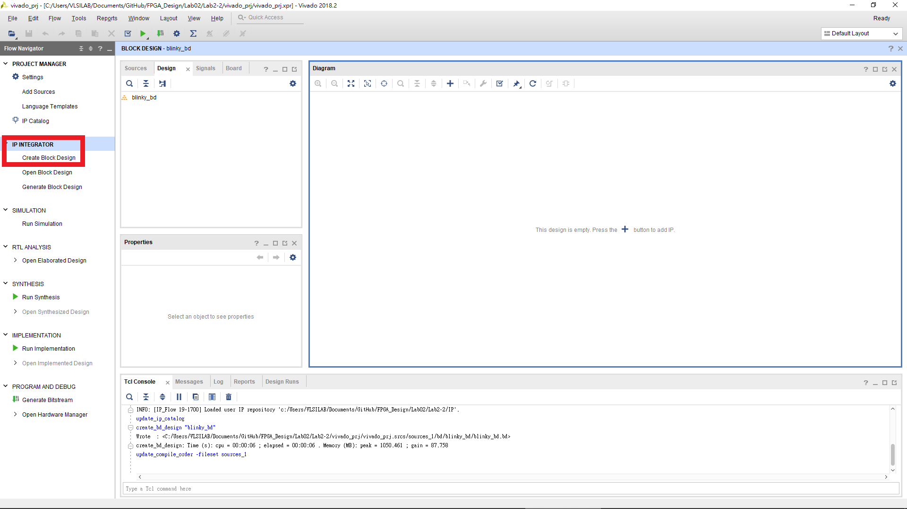

點選介面中間 Diagram 的 + 號後可選擇所需 IP。

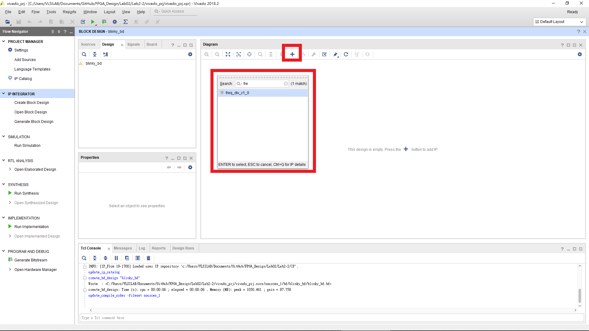

加入剛剛所製作的兩個 IP 並拉線成下圖所示。

在空白處點擊右鍵，選擇 Create Port。

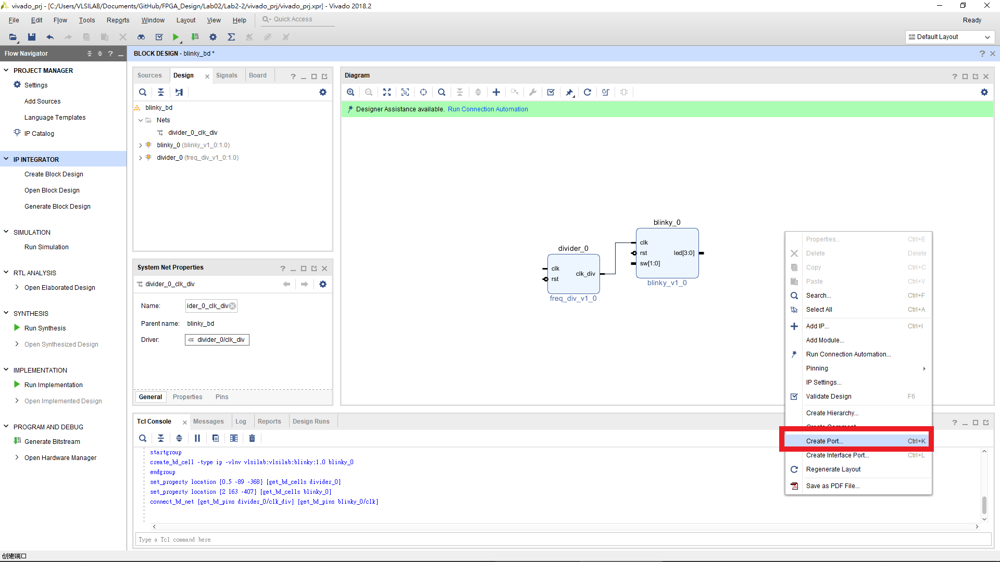

分別建立 `rst clk sw led` 四個 ports，並如下設定。

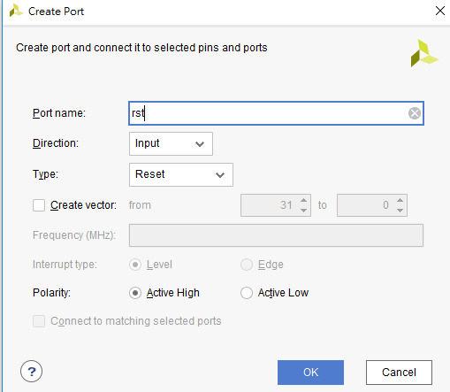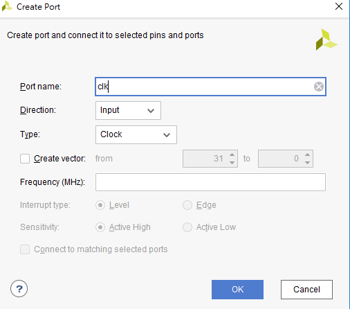

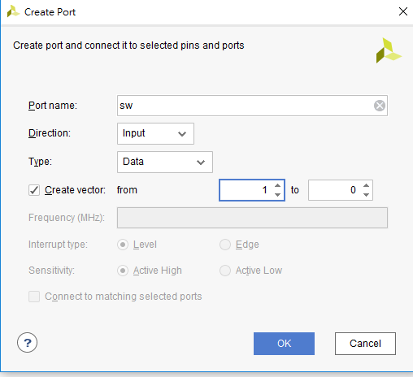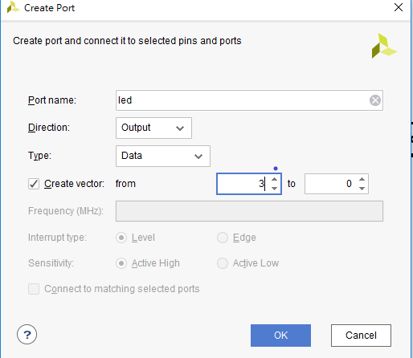

設定完成後拉線至對應位置完成如下圖的樣子並按下上放的 Validate Design 檢查設計。

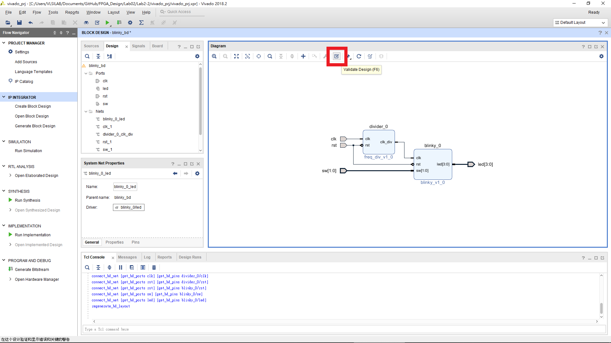

將做好的 block design 包成一個 HDL wrapper。

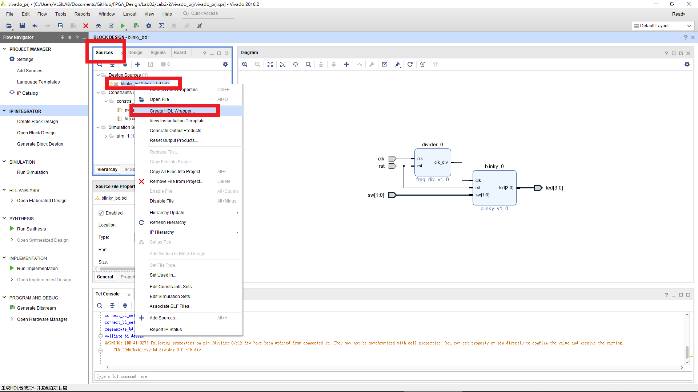

## Step 6. Generate bitstream
請回顧 [Lab01 Step2](https://github.com/ncku-vlsilab/FPGA_Design/tree/master/Lab01#step-2-generate-bitstream)

## Step 7. Program FPGA
請回顧 [Lab01 Step3](https://github.com/ncku-vlsilab/FPGA_Design/tree/master/Lab01#step-3-program-fpga)
