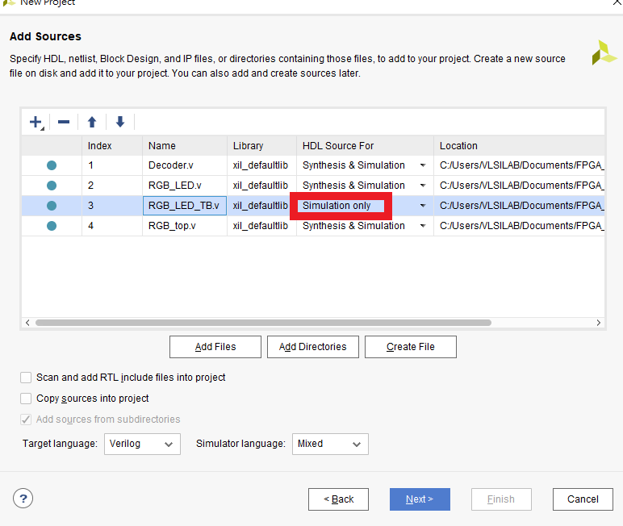
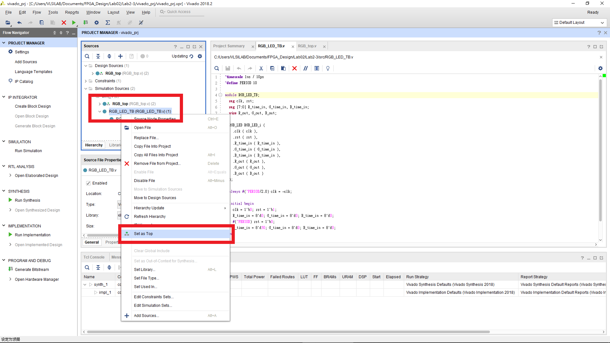
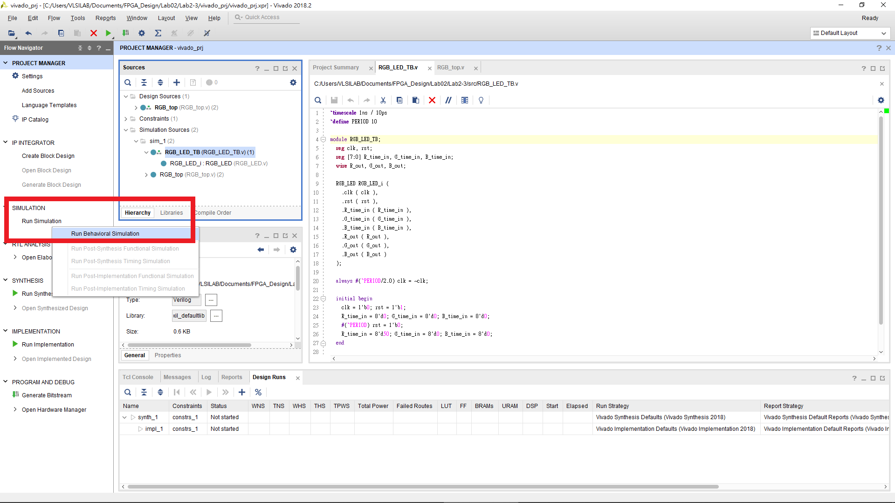
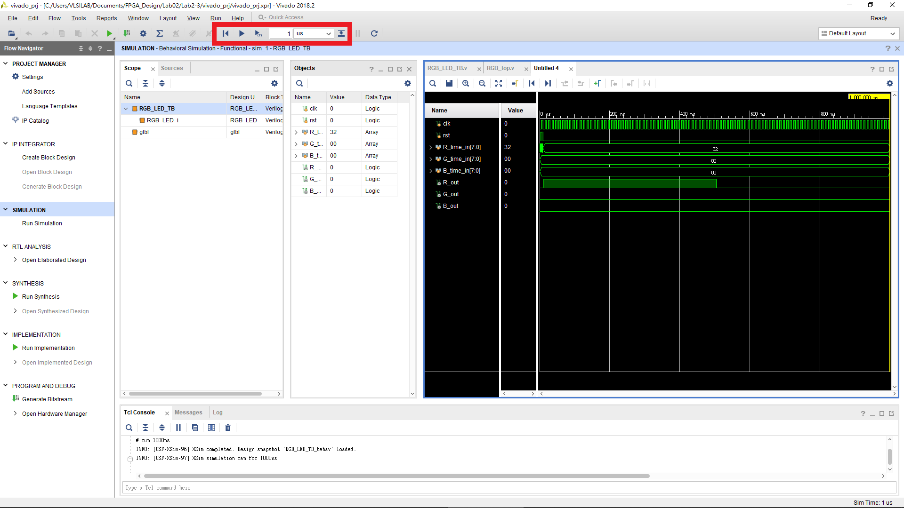

FPGA Design Lab2-3 - PWM Circuit
=================

## Purpose

此次實驗實作一個 PWM 電路來控制 RGB LED 的顏色。

## Add simulation file

將 `Lab2-3/src` 內的檔案全部加入，其中將 `RGB_LED_TB.v` 的HDL Source For 改成 Simulation only。
> NOTE: `RGB_LED_TB.v` 只是模擬用不會燒到FPGA，不須合成。

## Simulation

`RGB_LED_TB.v` 只模擬 `RGB_LED.v` 而不是整個 Design，需把 `RGB_LED_TB.v` 設為 Top 模擬時才不會跑 `RGB_top.v` 的模擬。

下圖為 Simulation 畫面，可透過選擇紅色部分的按鈕來更改模擬的時間。

