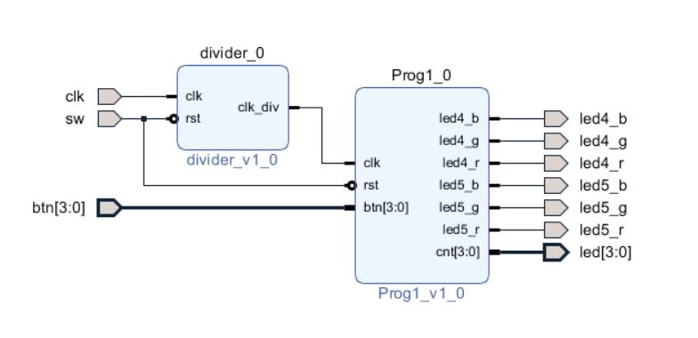

# FPGA-based System Design - Lab02 HW
## 成員名單
E24046357、E24046399、E24042060
## Programming 1
### 設計說明
#### Block Design

在這次的作業中，會用到兩個IP：第一個是上實驗課時助教提供的**Clock Divider(除頻器)**，第二個則是自己設計的**Traffic Light Controller(以下簡稱TLC)**。Clock Divider上課時助教已經講過了就不再說明，下面主要對TLC做說明：

#### 綠燈控制信號

| sw[0] | btn[0] | btn[1] | btn[2] | btn[3] |
| -- | -- | -- | -- | -- |
| 1為reset | 在綠燈時，counter+1 | 在綠燈時，使counter暫停(hold) | 在綠燈時，使counter填滿1 | 在綠燈時，使counter填滿0 |

#### FSM 狀態
[在div_clk的正緣觸發]

| State | Description | RGB LEDs |
| -- | -- | -- |
| RESET | 將Counter填滿1 |  |
| RED | 每次觸發Counter-1，當Counter歸零時跳至GREEN | RED/NONE |
| GREEN | 每次觸發時若沒有btn信號輸入，Counter-1；當Counter歸零時跳至YELLOW | RED/GREEN |
| YELLOW | 將Counter填滿1後直接跳至RED/兩個RGB LED顏色為R/Y | RED/YELLOW |

#### 操作說明

在Program Device後，使用者必須先把sw[0]切至1，再切至0，紅綠燈即可開始運作。
一開始是15秒的紅燈，無法透過按鈕改變其秒數。
紅燈結束後，會直接變為綠燈，此時使用者可以透過按鈕控制綠燈的秒數(如上表)。
當綠燈秒數歸零後，會有一秒的黃燈，接著再回到紅燈，繼續下一個Cycle。

## Programming 2
### 設計說明
#### Block Design

(在這個作業中我們並沒有把自己設計的Decoder以及RGB_LED驅動電路包成IP，所以使用PPT來繪製Block Design Diagram)
#### Decoder設計
| I/O | Port | Description |
| -- | -- | -- |
| Input | clk | 經由除頻器降頻後的clock信號，目的是為了要讓調整後的RGB的PWM值可以在LED上顯示，所以PWM值設定為4 bits，因此降頻讓使用者可以確實控制PWM值 |
| Input | sw | 切換RGB PWM值的控制，00為輸出 |
| Input | btn[0] (rst) | 使RGB的PWM值都歸零 |
| Input | btn[1] (output_valid) | 當sw為00時，輸出RGB_LED |
| Input | btn[2] (add) | 當sw不為00時，使PWM值+1 |
| Input | btn[3] (sub) | 當sw不為00時，使PWM值-1 |
| Output | led[3:0] | 當sw為00時，輸出1111；當sw不為00時，輸出對應色彩的PWM值 |
| Output | RGB_time_out | 輸出RGB的PWM值給RGB_LED |
#### RGB_LED驅動電路設計
| I/O | Port | Description |
| -- | -- | -- |
| Input | clk | Sysyem clock |
| Input | btn[0] (rst) | 使內部counter歸零；counter為4 bits |
| Input | RGB_time_in | RGB之PWM值 |
| Output | RGB_out | 當RGB_time_in>counter時，輸出為1；反之為0 |
#### 實際操作
- rst後，sw切至00

- sw切換至10，將Green之PWM值調整至0001

- sw切換至00，按下btn[1]，輸出為微弱的綠色

- 將Green之PWM歸零後，sw切換至01，將Red之PWM值調整至0101

- sw切換至00，按下btn[1]，輸出為較亮的的紅色

- Red之PWM值不變，sw切換至10，將Green之PWM值亦調整至0101

- sw切換至00，按下btn[1]，輸出為較亮的的黃色

- 將Red之PWM值歸零後，sw切換至11，將Blue之PWM值亦調整至0101

- sw切換至00，按下btn[1]，輸出為充滿少女情懷的的❤❤❤Tiffany藍❤❤❤

> Written with [StackEdit](https://stackedit.io/).
