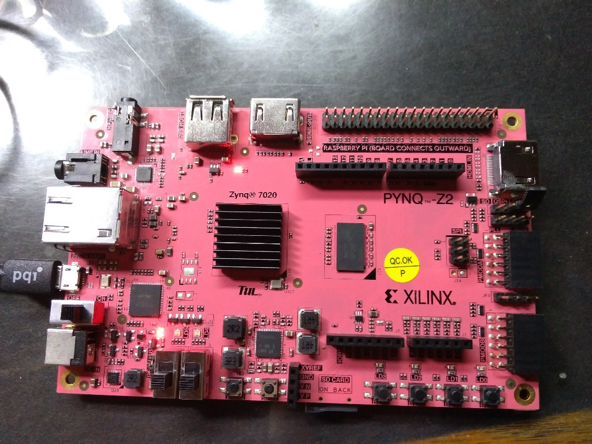
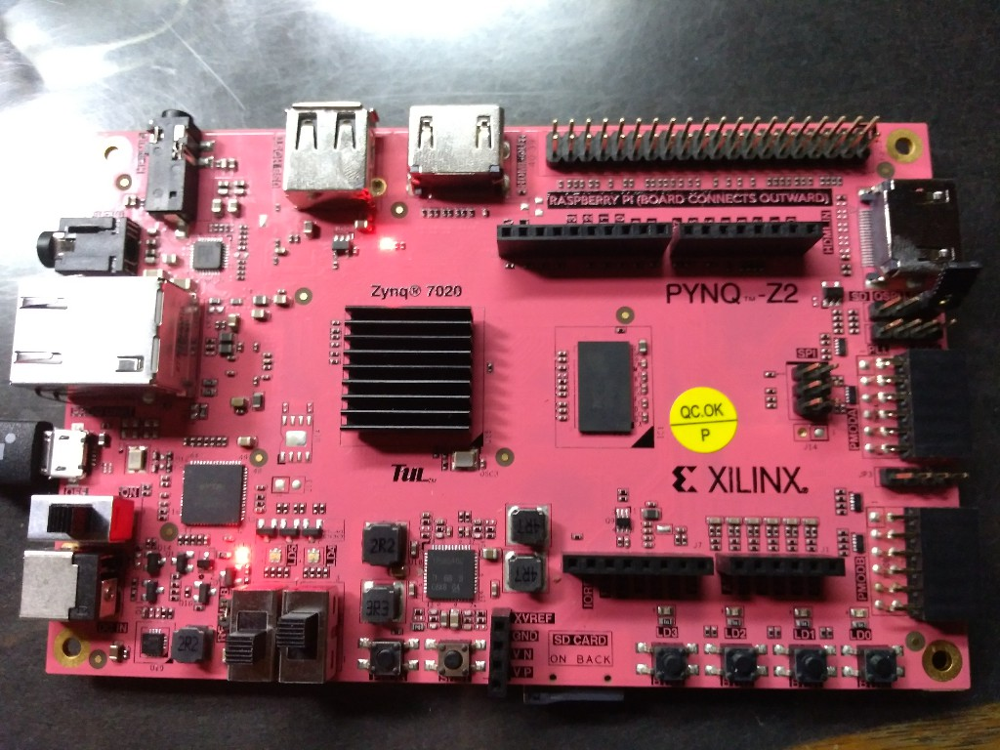
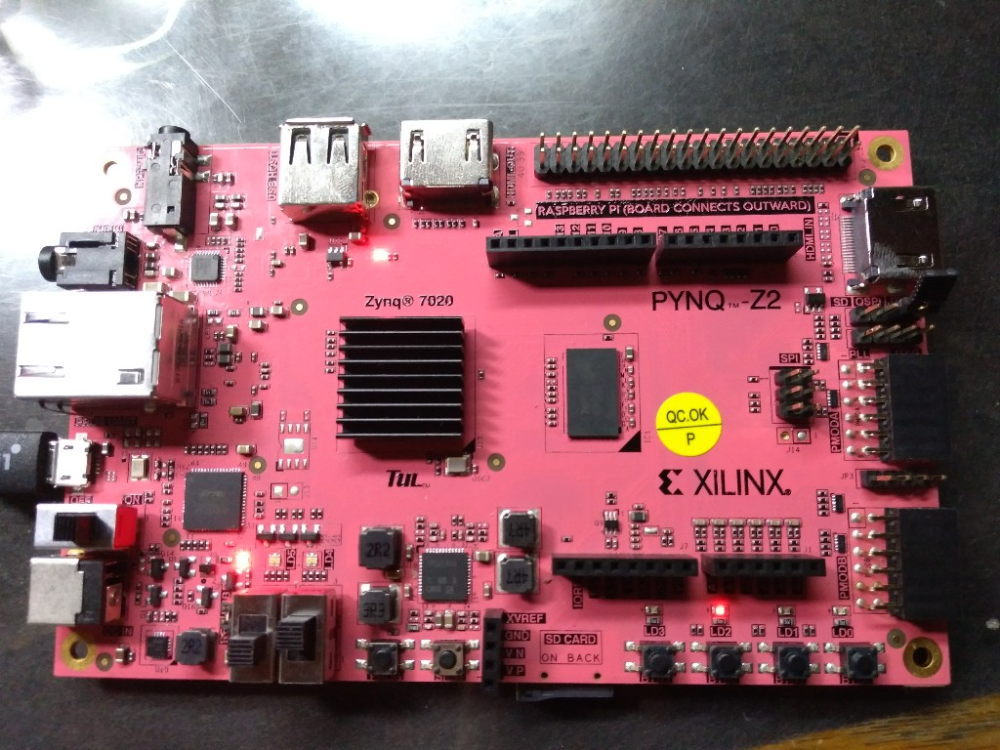
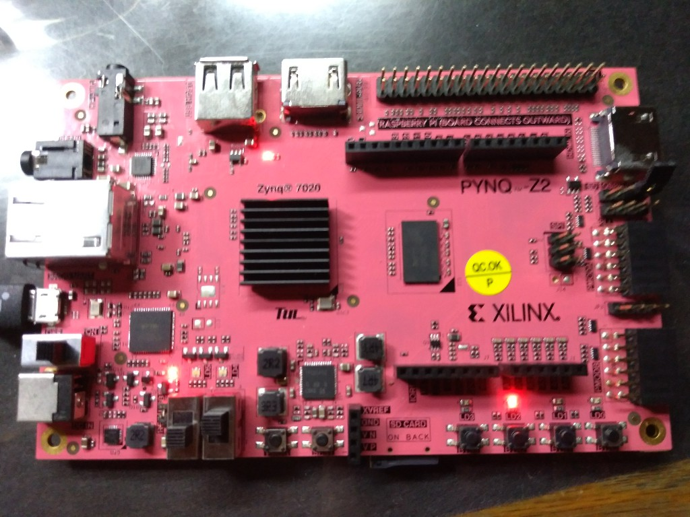
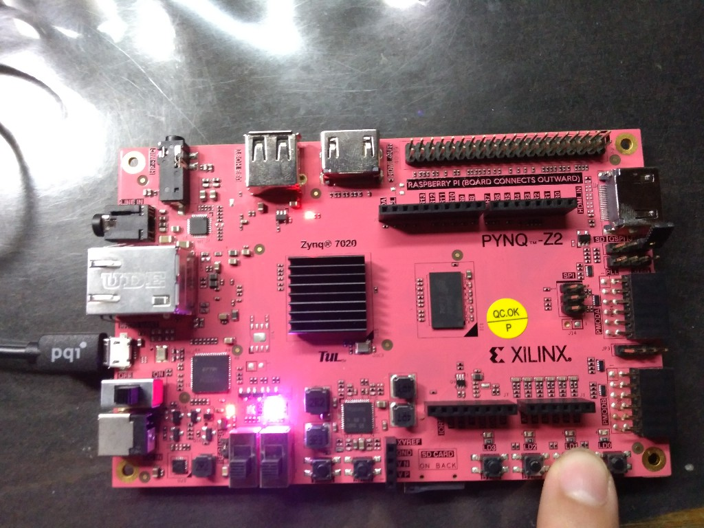

FPGA-based System Design - Lab02 HW
=

* [Member](#Member)
* [Program 1](#Program1)
* [Program 2](#Program2)

<h2 id="Member">Member</h2>

- E24056572   
- E24056637   
- E24054203  

<h2 id= "Program1">Program1</h2>
<h3 id = "Introduction1">Introduction</h3>

作業要求使用LED顯示秒數，但是我們覺得這太不直觀了，因此我們決定使用七段顯示器來呈現秒數。  
在我們的實作中，sw0時按下調整的按鈕會調整rgb0的綠燈秒數，sw1按下則會調整rgb1的綠燈秒數，兩個開關都是1則同時修改。  

<h3 id = "Programming1">Programming</h3>

這份作業中我們使用到兩個共陽極七段顯示器，輸出腳位使用板載Arduino相容接口的14個數位GPIO。雖然也可以透過調整共陽訊號，讓兩個七段顯示器共用7個腳位使得兩個顯示器只用到9個輸出，但是因為實作上比較麻煩，我們直接將共陽訊號接到板子上的3v3腳位，並利用GPIO控制其餘的14個腳。  
另外由於在這份作業中按鈕的穩定性會影響到調整秒數時的結果，因此要使用到debounce電路，在debounce電路中我們使用的是1000赫茲的時脈，而在紅綠燈秒數的控制上使用的則是1赫茲的時脈。

<h3 id = "Result1">Result</h3>

輸入輸出配置  

Default setting  

    綠燈時間(有二個):預設15秒(F~1)
    黃燈時間: 4秒(4~1)
    紅燈時間:4秒(4~1)
    一開始亮最右邊的RGB LED

Output:

    ar[13:0] : 連接七段顯示器，顯示8 bit 16進位數值。由於設計的關係，「00」實質代表256秒  

     第0個 RGB_LED  
    led4_r  
    led4_g  
    led4_b  (與sw[0]數值相同)  

    第1個 RGB_LED  
    led5_r  
    led5_g  
    led5_b  (與sw[1]數值相同)  

Input:

    1. btn[3:0]
        btn[3]:reset to Default setting
        btn[2]:控制state machine的暫停與否，按一下即可切換
        btn[1]:將sw指定的綠燈時間加1秒
        btn[0]:將sw指定的綠燈時間減1秒

    2. sw[1:0]  
    如果sw[i]是on，7seg顯示第i個rgb led綠燈的持續時間，並使第i個RGB_LED的藍燈亮起來，使btn[1]與btn[0]可以運作。  

一旦sw[1]與sw[0]同時為on，7seg顯示的為兩個RGB_LED的綠燈時間(主要是第1個RGB_LED)，且第0個RGB_LED的綠燈時間因此與第1個的一模一樣  

<h2 id= "Program2">Program2</h2>
<h3 id = "Introduction2">Introduction</h3>

我們覺得題意說明不大清楚，因此這份作業是基於我們自己的詮釋而寫的，在此先解釋我們所理解的內容。  
    
        使用按鈕調整 RGB LED 的 RGB值。
        1. botton 1 reset RGB 的 PWM 值。
        2. botton 3, 4 分別為增加或減少 PWM 值。
        3. switches 為 01 時，調整 R 的 PWM 值。
        4. switches 為 10 時，調整 G 的 PWM 值。
        5. switches 為 11 時，調整 B 的 PWM 值。
        6. LED 會顯示 switches 對應的 RGB 的 PWM 值。
        7. switches 為 00 時，按下 botton 2 顯示 RGB LED。

-   不管在什麼情形下，按下btn1一律重設RGB PWM值
-   第六點要求的意思是，我們在調整PWM值時，不會立刻將結果輸出到RGB LED上，而是先用其他LED顯示目前的值，這個顯示的方式我們自行決定，而當我們將開關調整至01、10、11時LED會根據開關輸出對應的PWM值，就算我們沒有按按鈕也是。 
-   **基於上述的理解，我們將顯示的方式以LED亮度呈現**，亮度越亮代表PWM值Duty Cycle越大，反之。
-   第七點的意思與第六點的理解呼應，沒有調到開關00與BTN2的話，RGB是關掉的，**BTN2按下去才會亮**。  

<h3 id = "Programming2">Programming</h3>

這次的作業使用了debounce、rgb led與一個controller電路。  
  
rgb led與lab2-3所使用的一樣，而在這次作業中因為按鈕的機械彈跳會影響到PWM增加的幅度，雖然這個問題可以靠降低控制器本身的時脈頻率解決，但是這樣會降低操作的順暢，因此這次要引入debounce電路。  
  
debounce的方式是利用除頻電路產生一個較慢的Clock，並加上一個D Flip Flop，利用較慢的取樣速度來避免取到按按鈕過程中的彈跳，換句話說就是降低解析度。另外為了避免調整PWM時出現一直按著按鈕不放導致數值一直增加的情況，在controller中增加了一個flag，除非使用者鬆開按鈕再按一次，否則會因為flag已經舉起而無法修改PWM。  

debounce的設計方式是參考<a href="https://www.fpga4student.com/2017/04/simple-debouncing-verilog-code-for.html">這裡</a>，只是考量到如果是btn1的話就會允許使用者一直按著按鈕，因此我們更改了設計，只使用一個D Flip Flop。
  

<h3 id = "Result2">Result</h3>

初始狀態，RGB LED的值均為0。  

將Switch切換至01，準備對R的PWM值進行調整。  

按下BTN3五次之後的結果，其亮度表示成50/255    
在調整的過程中會將亮度顯示在BTN3前方的LED，由LED的亮度直接判讀PWM值。  

下圖為按下BTN3 25次的結果，亮度為250/255  
   
SW切換到11後對藍色值進行調整，亮度調至250/255後，將開關調回00並按下BTN2將結果輸出至RGB LED上。結果是紅色與藍色混合成的紫色燈。      
