FPGA Design Lab3-1
=================
## Step 1. Download PuTTY

Here's [PuTTY](https://www.putty.org/)

## Step 2. Create a new project
請回顧 [Lab01 Step1](https://github.com/ncku-vlsilab/FPGA_Design/tree/master/Lab01#step-1-create-a-new-project) 但不需加入任何 HDL code 及 Constraints。

## Step 3. Create block design

回憶 [Lab2-2 Step5](https://github.com/ncku-vlsilab/FPGA_Design/tree/master/Lab02/Lab2-2#step-5-block-design)。

加入 ZYNQ7 Processing System IP

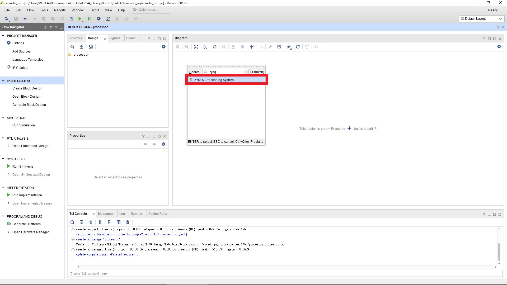

按下 Run Block Automation

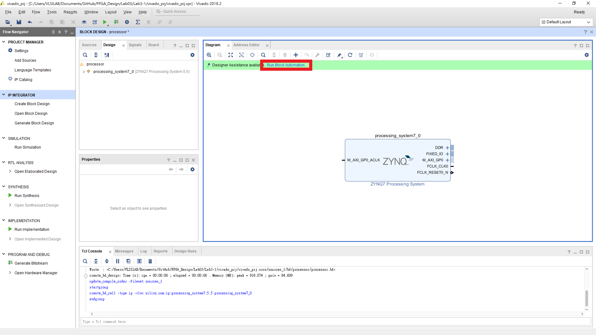

執行完畢 ZYNQ processor 會連出兩個 ports。

點開 ZYNQ processor 更改設定。本次實驗只需用到 ZYNQ processor 本身，所以要把沒用到的 I/O 取消。

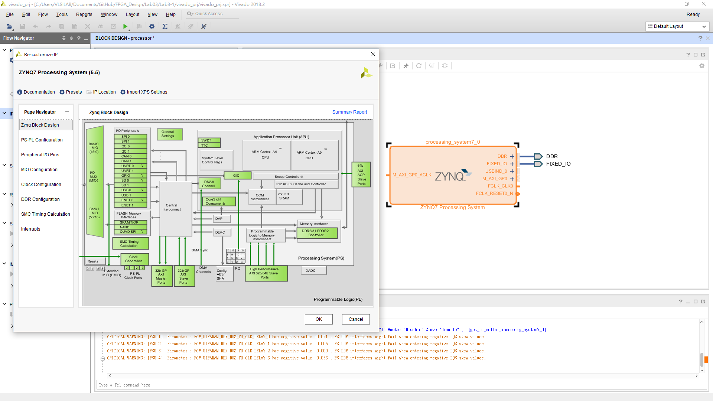

PS-PL Configurations > Gneral > Enable Clock Resets > FCLK_RESET0_N 取消勾選。  
PS-PL Configurations > AXI Non Secure Enablement > GP Master AXI Interface > M AXI GP0 Interface 取消勾選。

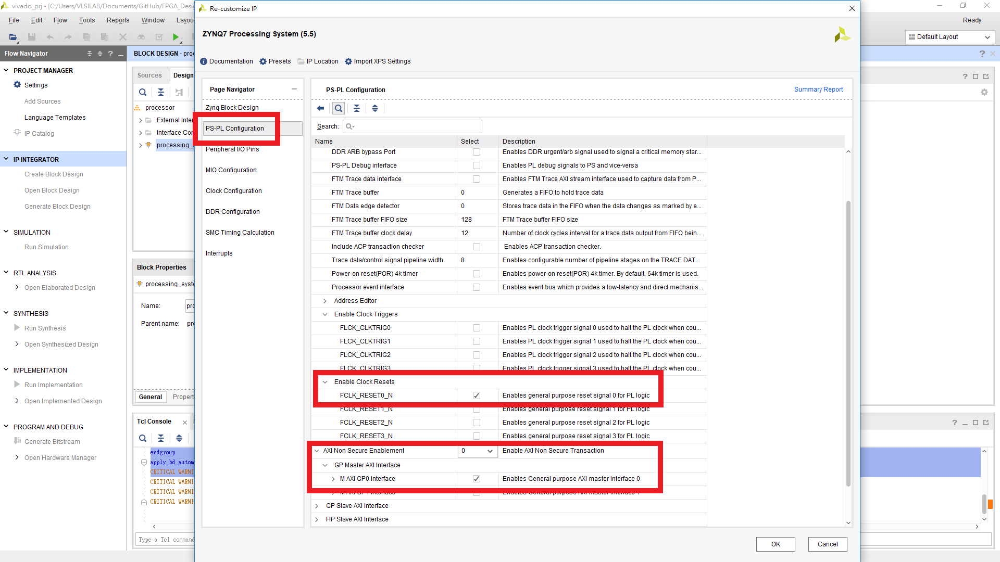

Peripheral I/O Pins 僅留下 UART0 其餘取消勾選。

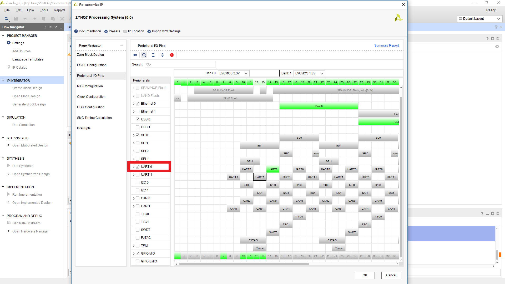

Clock Configuration > PL Fabric Clocks > FCLK_CLK0 取消勾選。

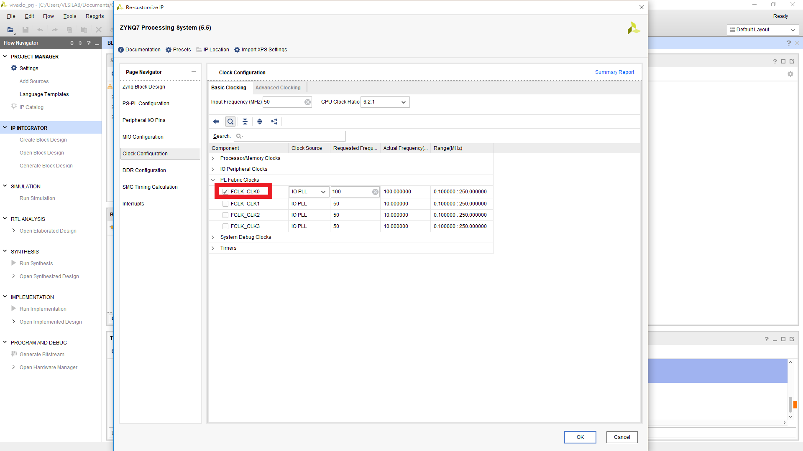

OK 後 Diagram 的 ZYNQ7 processor 會變成如下圖所示。

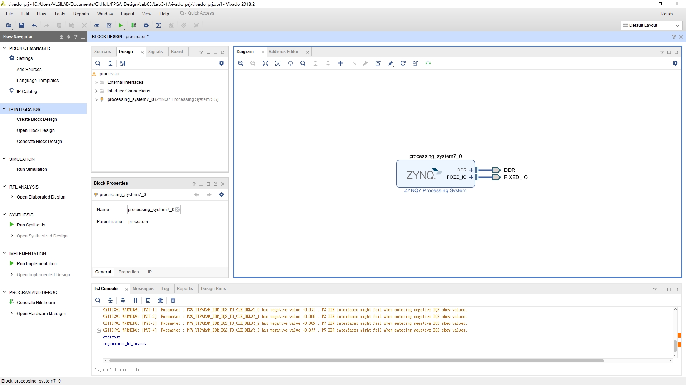

將完成的 block design 包成 HDL wrapper (Lab2-2 Step5 最後一步)。

## Step 4. Run Implementation

按下 PROJECT MANAGER > Run Implementation。
> NOTE: 由於本次實驗僅使用 ZYNQ 現有的 ARM processor，無需產生 bitstream 所以只需執行到 Run Implementation 即可。

## Step 5. Launch SDK

File > Export > Export Hardware。

File > Launch SDK

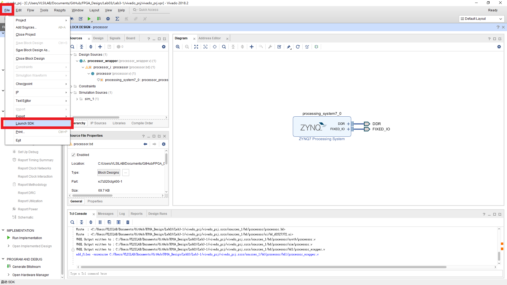

SDK GUI 如下圖所示。

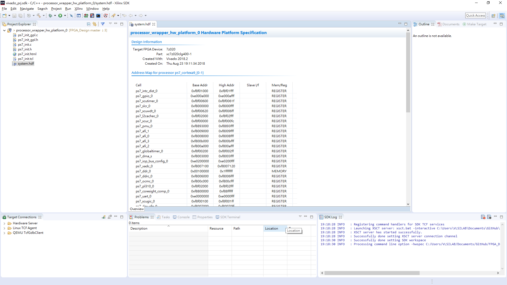

## Step 6. Write a hello world program

File > New > Application Project > 命名 > Next > Empty Application > Finish

新增空的 source file 並將 Lab3-1/src/hello.c 的內容貼上。

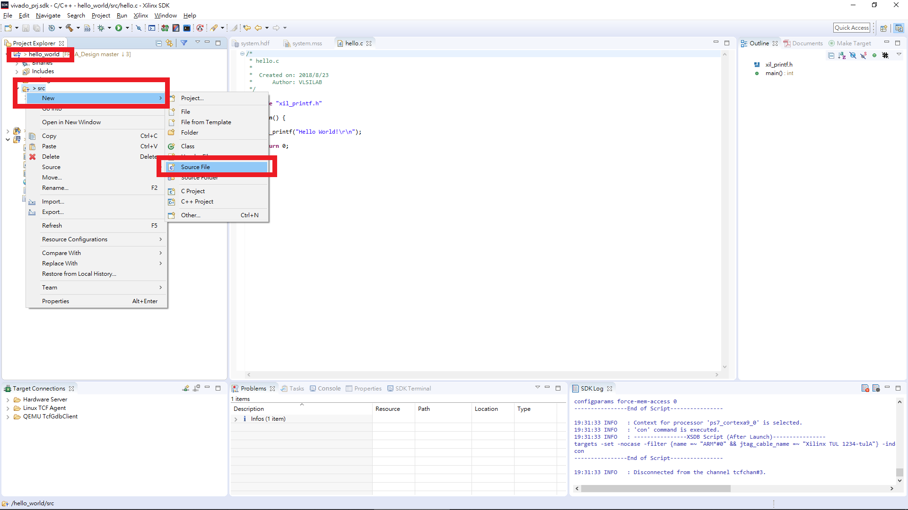

開啟 PuTTY，選擇 Serial，輸入連接 FPGA 的 COM，設定 Baud rate 為 115200。
> NOTE: 板子的電源必須開啟。

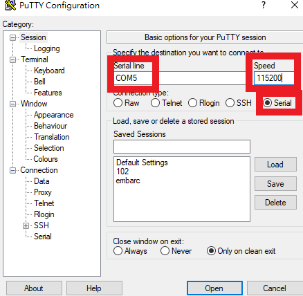

回到 SDK，Run > Run Configuration。

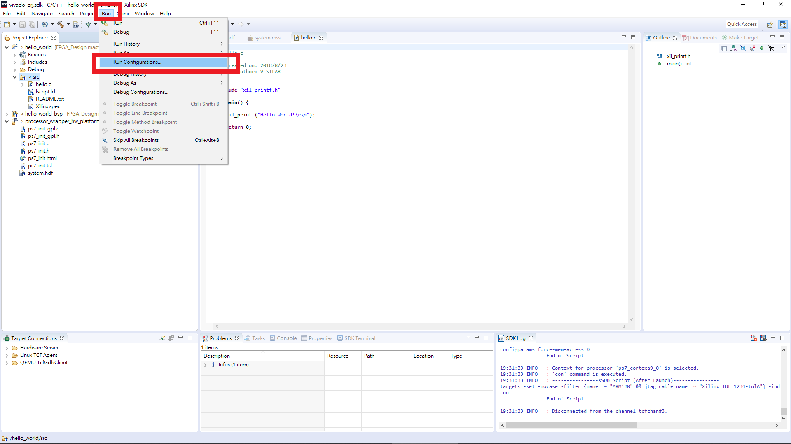

Xilinx C/C++ Application (GDB) 點兩下 > Target Setup。

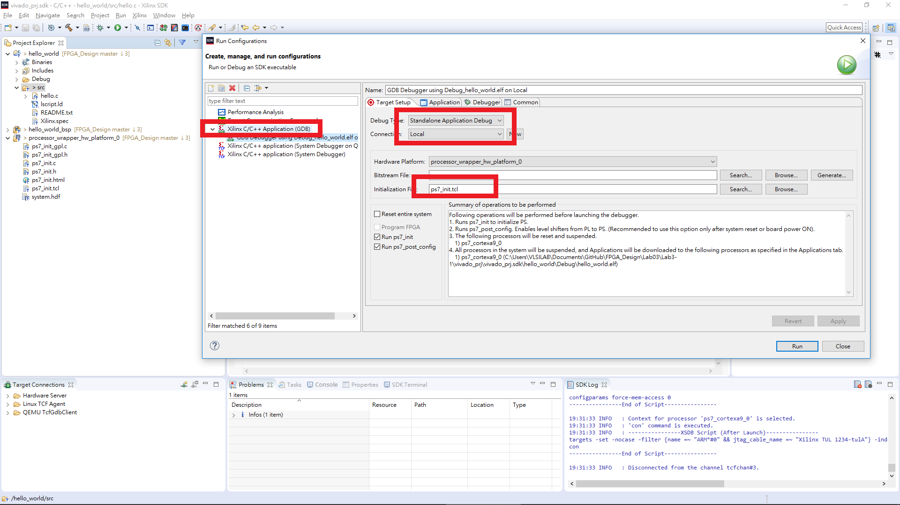

到 Application 選擇創建的 project。

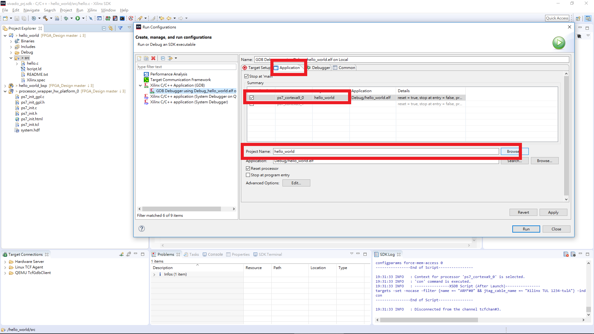

按下 Run，切換到剛剛開啟的 PuTTY 畫面會出現 "Hello World!" 表示成功。

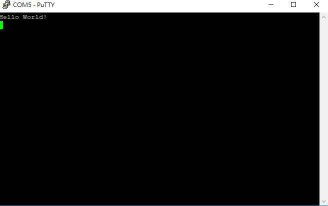
