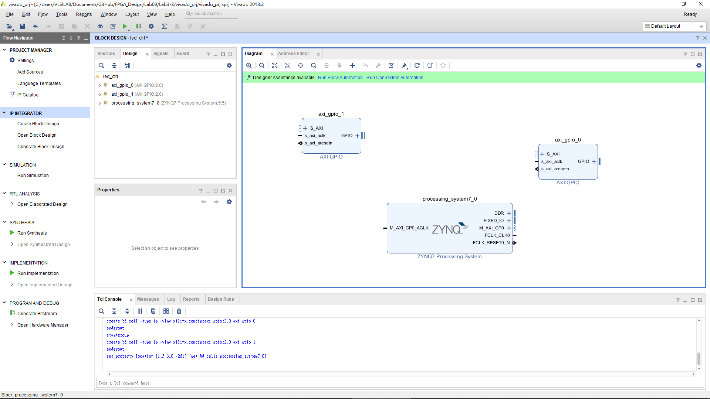
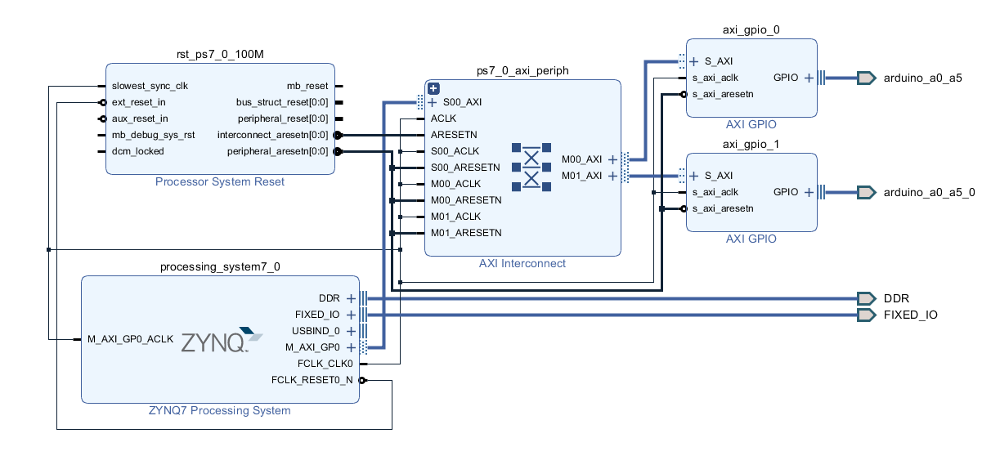
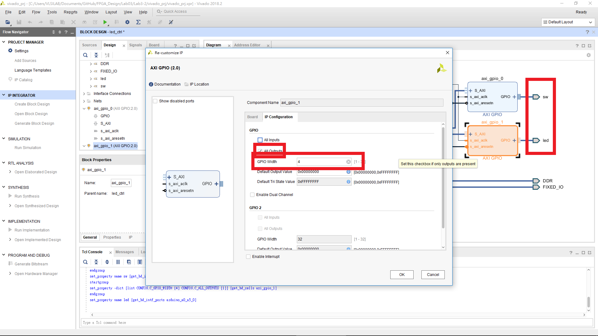
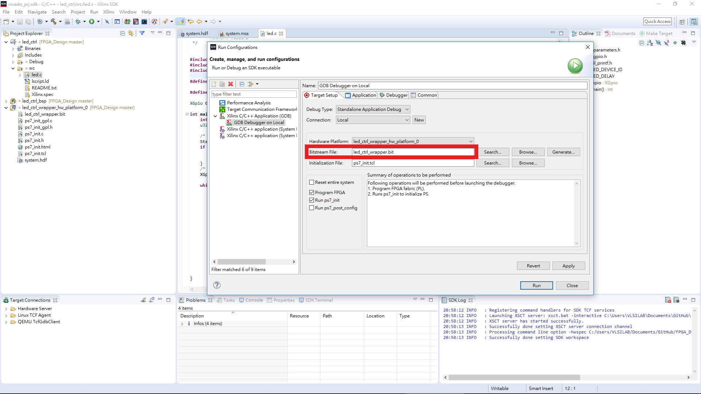

FPGA Design Lab3-2
=================

## Step 1. Create a new project

請回顧 [Lab01 Step1](https://github.com/ncku-vlsilab/FPGA_Design/tree/master/Lab01#step-1-create-a-new-project) 僅需加入本次實驗所提供的 Constraints。

## Step 2. Create block design

本次實驗需加入三個 IP `ZYNQ7 Processing System, AXI GPIO*2`

Run Block Automation > OK (全部勾選)  

Run Connection Automation > OK (全部勾選)

Vivado 會自動幫我們接上 AXI Interconnection 形成下圖。

點開 AXI GPIO IP 將 GPIO 改成 Custom (兩個 AXI GPIO IP 都要改)。

切換到 IP Configuration，分別改成以下兩個設定，因為一個是接到 LEDs 一個是接到 Switches。

設定完成後，更改連接出去的 port name，方便辨認。

將完成的 block design 包成 HDL wrapper (Lab2-2 Step5 最後一步)。

## Step 3. Generate bitstream
請回顧 [Lab01 Step2](https://github.com/ncku-vlsilab/FPGA_Design/tree/master/Lab01#step-2-generate-bitstream)

> NOTE: 不同於 lab3-1，AXI GPIO 是由 programmable logic 執行的所以需產生 bitstream 將 AXI GPIO 燒錄到 FPGA 上。

## Step 4. Launch SDK

File > Export > Export Hardware。
> NOTE: 由於有產生 bitstream 所以 include bitstream 的選項需打勾。

File > Launch SDK

## Step 5. Write a LEDs control program

請回顧 [Lab3-1 Step6](https://github.com/ncku-vlsilab/FPGA_Design/tree/master/Lab03/Lab3-1#step-6-write-a-hello-world-program)

空的 source file 請貼上 `Lab3-2/src/led.c` 的內容。

在執行 Run Configuration 時，由於這次有產生 bitstream 所以會多出現一個 `.bit` 檔案。

