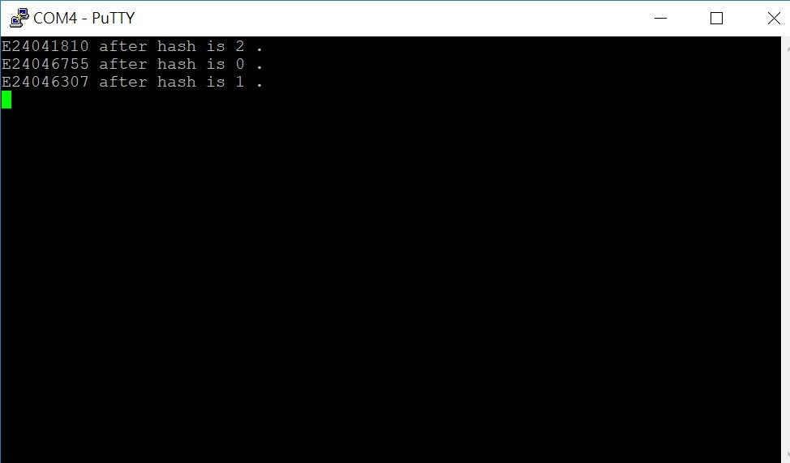
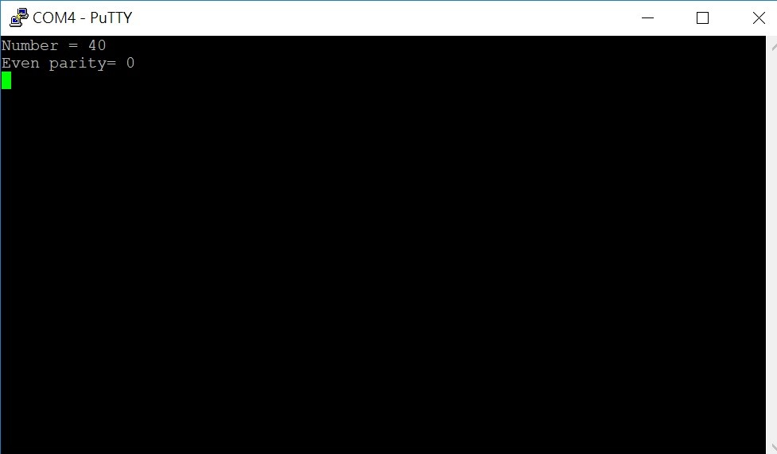
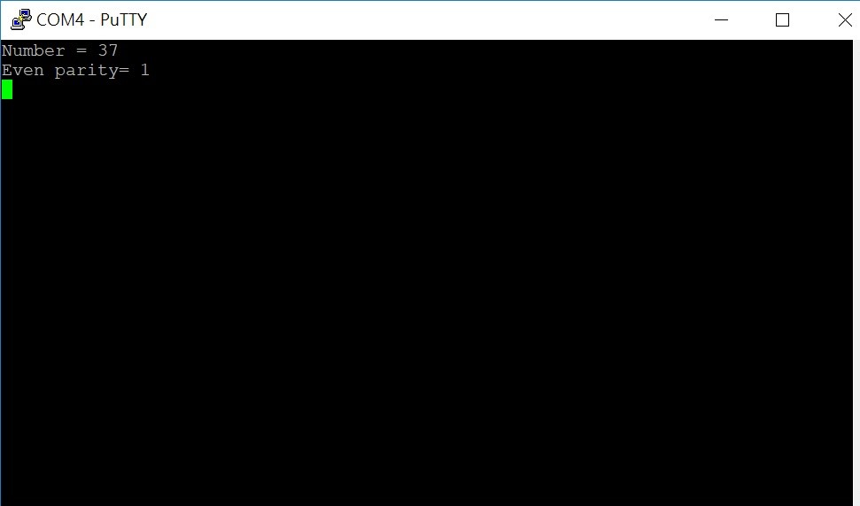

FPGA_Design Lab03 HW
====

# 成員名單
E24041810 E24046755 E24046307 

# Question 1.
### 請問在不改動任何設定下，ZYNQ CPU 儲存資料的方式是 big-endian 還是 little-endian?
答案為 little-endian 。我們是利用C語言的union去判定的，所有在union裡頭宣告的變數會共享同一個記憶體空間。
因此我們在union裡設定一個long l以及一個大小為4的char c，在main function裡給予l值為0x12345678，
這時只要c[0]是0x78、c[1]是0x56...以此類推則為little-endian；
相對若c[0]是0x12、c[1]是0x34...以此類推則為big-endian。

# Program 1.1
### 用 switch 切換每個組員的學號，當按下 button 後 LED 會輸出學號的摩斯密碼。
### 設計說明
1. 其中我們這次作業會用到的是英文字母E，還有數字的部分。
2. 長條形的符號在實作上，我們會讓LED亮比較長的時間，而圓形符號則是讓LED亮比較短的時間。
3. LED有四個，如果說我們要顯示學號的第一個字，則LED的訊號會是(0001)，然後再調整亮的時間長度及閃爍次數。
   如果是要顯示學號第三個字，LED的訊號會是(0101)，接著調整亮的時間長度和閃爍次數。因為學號有9個字，所以LED的訊號會是從(0001-1001)依序閃爍。
   舉E24046755為例來說，我們今天要顯示E這個英文字母的摩斯密碼，因為E是第一個字，所以LED訊號會是(0001)也就是LD0的位置會亮，
   接著看E的摩斯密碼是一個圓形，所以(0001)會快速閃爍一次。第三個字是4，所以LED訊號會是(0011)，也就是LD0和LD1同時亮，
   然後4的摩斯密碼是4個圓形1個長條，所以LED(0011)會迅速閃爍4次再亮1次較長的時間。
4. 藉由Switch的調整，我們可以改變現在顯示的是哪個組員的學號，舉例來說:
   我們的組員有三個人，如果要顯示第一位同學(E24041810)的摩斯密碼，則將Switch設為01，第二個組員(E24046755)是10，第三個(E24046307)是11。

### 實驗結果
  我們把影片放在youtube上，且這段為E24041810的摩斯密碼。
  https://youtu.be/ijYeoS1fZDc

# Program 1.2
### 計算 hash function 並在 putty 上顯示出學號經由 hash function 的結果。
### 設計說明
 我們使用的是較為簡單的 hash function，由於總共有3個學號，因此我們將3個學號分別除以3取餘數，
 若碰到取完餘數結果為重複時，較晚做 hash function的學號則將結果減一，若再重複則再次減一，直到沒重複為止。
 而在這裡是搭配program1.1的sw去分別顯示三個學號的hash function。
 
### 實驗結果

# Program 2
### 輸入 32-bit 資料並計算其 parity bit。
### 設計說明
 我們的是採用 even parity，使用者可以更改程式碼中number這個變數的值，且我們設定輸入的數字為十進位，
 而我們再將數字轉為二進位存到一個陣列中，再計算陣列中總共有幾個1，並把它除以2取餘數，以判斷其even parity。
  
### 實驗結果

