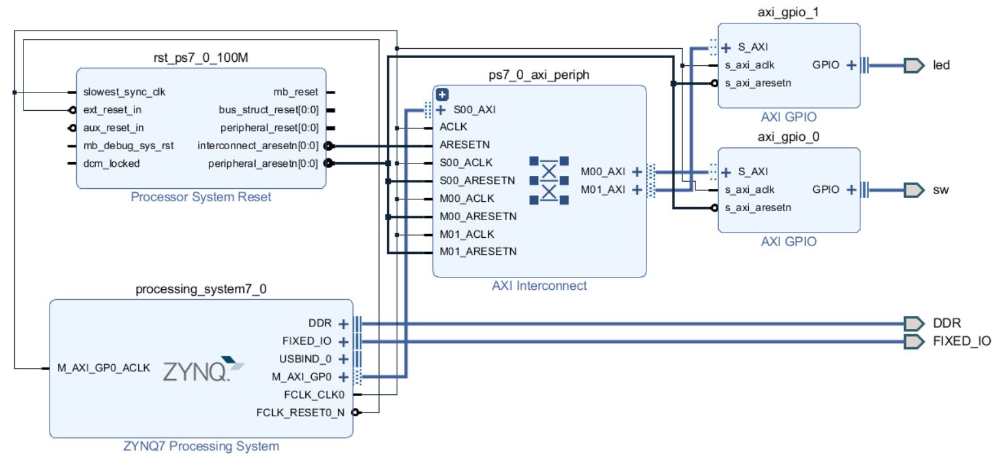

# FPGA-based System Design - Lab03 HW
## 成員名單
E24046357、E24046399、E24042060
## Question 1.
### 請問在不改動任何設定下，ZYNQ CPU 儲存資料的方式是 big-endian 還是 little-endian?
 **Ans : Little Endian** 
 一開始猜測這個答案應該在調整ZYNQ CPU IP裡面的選項找得到，但最後卻撲了空。
 於是上Xilinx的官網找到了ZYNQ CPU的spec，但也全都找不到相關的答案。
 因為ZYNQ CPU其實是ARM的CPU，於是到ARM的官方論壇，看到了一篇文章標題寫著"[How and Where do I change Endianness in Cortex-A9?](https://community.arm.com/processors/f/discussions/3313/how-and-where-do-i-change-endianness-in-cortex-a9)"
 文章內提到他想要將CPU的儲存型態改成Big-endian，所以猜測答案為Little endian。
 
## Block Design
這次作業的三個Program皆是使用同一個電路：

## Programming 1-1
### 問題描述：用 switch 切換每個組員的學號，當按下 button 後 LED 會輸出學號的摩斯密碼
### 程式說明
這題的做法我們是先將每個組員的學號的摩斯密碼用手寫展開來，再四個四個bits切開來宣告成constant，再由LED一次顯示4個bits。
而摩斯密碼的編碼則是採用**二進位程式碼以及短碼**
Switch的切換對應如下表：

| sw | 學號 |
| -- | -- |
| 00 | E24046357 |
| 01 | E24046399 |
| 10 | E24042060 |
| 11 | 顯示查無此人，LED持續輸出1111 |

### 實際操作

## Programming 1-2
### 問題描述：計算 hash function 並在 putty 上顯示出學號經由 hash function 的結果
### 程式說明
這題我們所採用的hash function為 [sha256](http://www.iwar.org.uk/comsec/resources/cipher/sha256-384-512.pdf)  
輸入任何訊息經過sha256輸出皆會變成256 bits的hash values，經常被用在數位簽證中的雜湊函數。
### 實際操作

### 驗證
我們使用線上的sha256產生器來做驗證：

## Programming 2
### 問題描述：輸入 32-bit 資料並計算其 parity bit
### 程式說明
這題相對於上面兩題相較簡單，而我們的做法為計算輸入的1的個數，再由其除以2的餘數來判斷奇偶性。
### 實際操作

> Written with [StackEdit](https://stackedit.io/).
