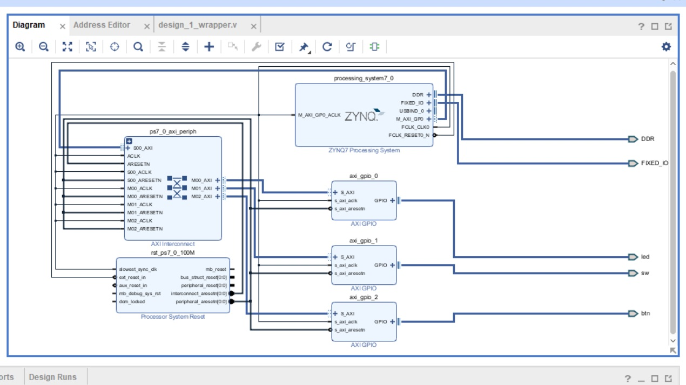
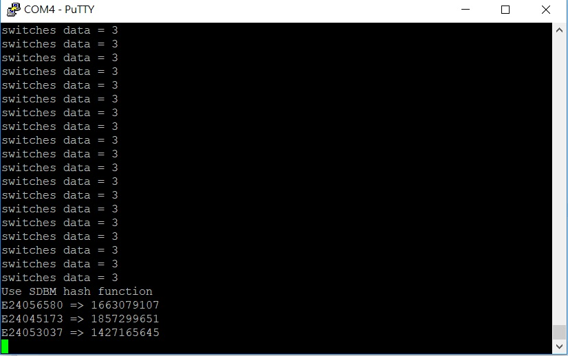
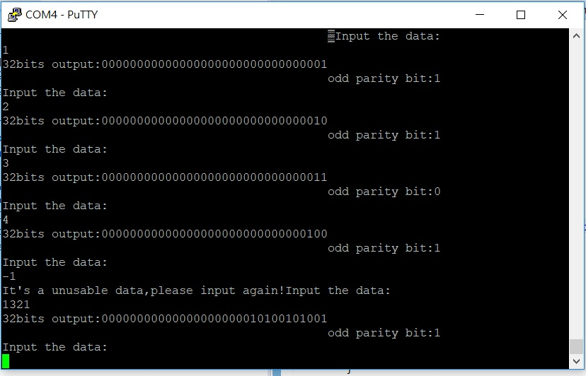



# Homework - Lab03

## 成員名單
E24056580   邱群硯	
E24045173   沈能健
E24053037   黑崇瑜

## Block Design
我們以下的電路都是在這個電路下實現

##  Question 1.
請問在不改動任何設定下，ZYNQ CPU 儲存資料的方式是 big-endian 還是 little-endian?
##  Ans.
我們經由ZYNQ CPU執行程式，判斷它將資料儲存至記憶體的順序為little endian.
##  Program 1.
  1. 用 switch 切換每個組員的學號，當按下 button 後 LED 會輸出學號的摩斯密碼。
  三位組員的學號分別為:
  
    E24056580   
	E24045173   
	E24053037   
  
  

  2. 計算 hash function 並在 putty 上顯示出學號經由 hash function 的結果。
我們使用的是SDBM hash function:

##  Program 2.
輸入 32-bit 資料並計算其 parity bit。
我們將輸入的整數計算為32bit的二進位數並計算它的odd parity bit

