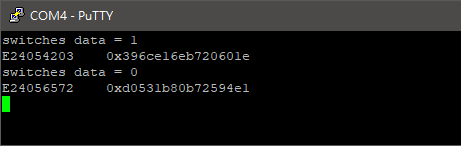
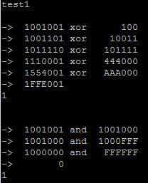
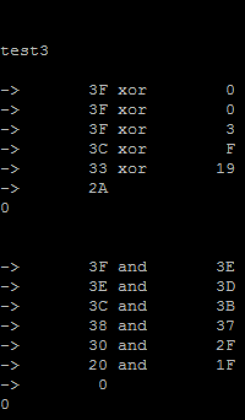
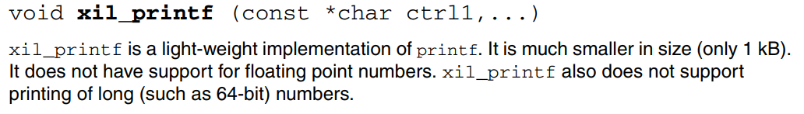
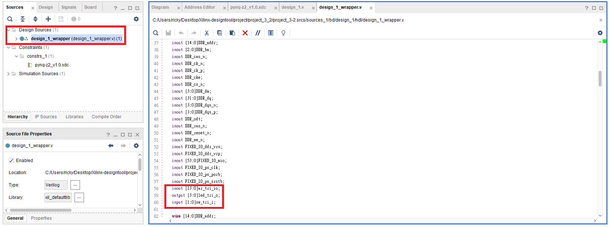
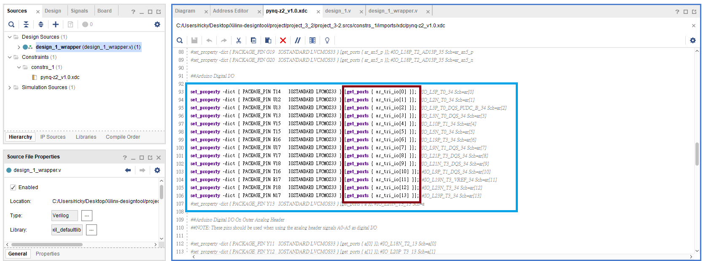
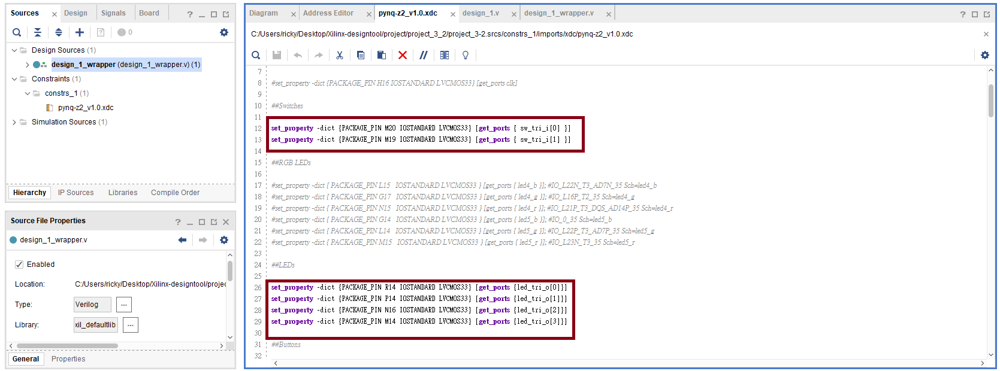
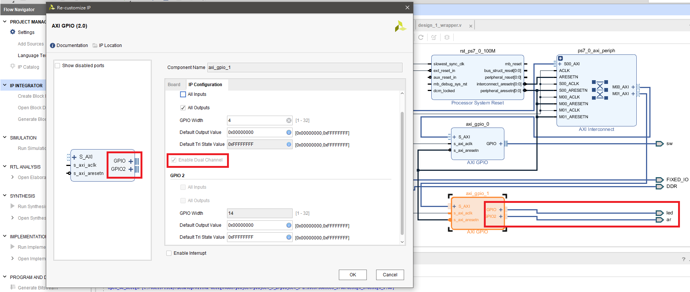
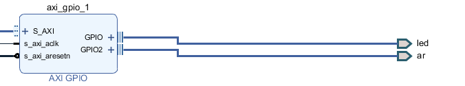
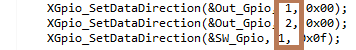

FPGA-based System Design - Lab03 HW
=

* [Member](#Member)
* [Question1](#Question1)
* [Program1](#Program1)
* [Program2](#Program2)
* [Note](#Note)
    *   [xil_printf and printf](#print)
    *   [XDC portname](#XDC)
    *   [Gpio channel](#GPIO)

<h2 id="Member">Member</h2>

- E24056572   
- E24056637   
- E24054203   

<h2 id = "Question1">Question1</h2>

Endianness與電腦讀資料的方向會影響資料的顯示，此處預設電腦是從lower address開始讀、寫資料。  
這個程式先存取16bits 的0x1234，再透過char* pointer取出8bits data。  
如果pointer指向12，代表big endian，反之為little endian

  

ZYNQ CPU儲存資料的方式應該是 little endian

<h2 id="Program1">Program1</h2>  

<h3>Introduction</h3>

作業要求使用Switch切換每個組員的學號並且按下按鈕後輸出摩斯密碼  
因為本組只有三個人，按鈕有四種狀態，因此我們將第四種狀態設定為輸出SOS摩斯密碼  
根據<a href = "https://zh.wikipedia.org/wiki/%E6%91%A9%E5%B0%94%E6%96%AF%E7%94%B5%E7%A0%81">摩斯密碼</a>的規定，摩斯密碼有兩種狀態，分別是Dit與Dah，以燈號表達摩斯密碼的話，實作如下：
    
    Dit為短亮，Dah為長亮
    Dah的長度為三倍的Dit長度
    每一個字元由一個至數個Dit、Dah組成，同一個字元的Dit、Dah之間間格為一個Dit的長度
    字元與字元之間的間格為三個Dit的長度
    單字與單字之間的間格為七個Dit的長度

除此之外，摩斯密碼亦可以用聲音、符號等方式呈現。  

而Hash Function的部分我們使用的是Fowler-Noll-Vo hash-1a hash function，關於FNV-1a的資料可以參考<a href = "https://en.wikipedia.org/wiki/Fowler%E2%80%93Noll%E2%80%93Vo_hash_function">這裡</a>  
相關參數

    #define FNV_OFFSET_BASIS_64B 0xcbf29ce484222325U
    #define FNV_PRIME_64B        0x100000001b3U 

下圖是我們的Block design  
</img>
  
<h3>Programming</h3>

我們在Header file裡面先寫好各個字元的摩斯密碼

    /*0 1 2 3 4 5 6 7 8 9 E S O*/
    const static char* morse_convert[] = {
    "11111","01111","00111","00011","00001",
    "00000","10000","11000","11100","11110",
    "0"    ,"000"  ,"111"
    };

以學號E24056572為例，該學號可表示為

    int neko[] 	= {10,2,4,0,5,6,5,7,2};

開關燈時間我們使用Xilinx提供的usleep function控制，usleep即為一般常聽到的delay function，其單位為微秒，比起使用迴圈達到目的，使用Timer或是delay function比較容易掌控長度，在這個作業中我們將一個Dit的長度設為200000微秒，即0.2秒。  

在這份作業中我們本來想要在Program Logic上實作debounce後透過axi gpio傳遞給Processing System，但是有一些Port或是Interface的設定尚未克服，因此我們先使用軟體實作簡易的debounce功能，

    for(int i = 1 ; i < 100 ; i ++){
		btn_data = XGpio_DiscreteRead(&Input_Gpio, 1);
		if(btn_data == 0){
			i = 0;
		}else{
			usleep(10);
		}
	}

連續100次，每次間格10微秒，當經過1000微秒按鈕都是1的狀態我們就認為使用者確實按下按鈕了，才會接著執行後面的程式碼。  

<h3>Result</h3>

</img>  
  
摩斯密碼結果參考<a href = "https://www.youtube.com/watch?v=ie8yxpYrBvk">影片</a>

<h2 id = "Program2">Program2</h2>

<h3>Introduction</h3>

此處用兩種方式實作，產生的結果由1 bit表示：1代表奇數、0代表偶數。  

- Method1:  
將data平分成2半，再將對半的data xor，直到最後只剩1 bit
對n bits input而言，複雜度為O(log2n)

- Method2:
將data與data-1 and起來，變成新的data，反覆操作直到data為0才結束。由於每次操作都會使新data的某個bit 由1轉為0，只要透過parity紀錄操作次數的奇偶性，即可得到parity bit.  
若只知道是n bits input，平均複雜度為O(n/2)，最糟複雜度為O(n)
若知道有k個bit是1，複雜度則為O(k)
適用於極少bit為1的data  
<a href="http://graphics.stanford.edu/~seander/bithacks.html?fbclid=IwAR0hBTjttNA7nAVff0Nw8-F0OeuoJyIrJusii8lX_e4Xc3cVyb_apHxjTh4#ParityNaive">Method2參考</a>

<h3>Result</h3>

</img>    

</img>  

</img>  
 

<h2 id="Note">Note</h2>  

<h3 id = "print">xil_printf and printf</h3>

在Program1實作過程中我們一直無法使用 xil_printf("0x%" PRIx64 "\n", hashed); 的語句成功輸出unsigned long long int型態的資料，後來搜尋<a href = "https://www.xilinx.com/support/documentation/sw_manuals/xilinx11/oslib_rm.pdf?fbclid=IwAR37BlG6_H1A2uL5kOWw4Mq5XBQTL7DOnuRZeKpDnERWOPvVE9neX4t_vRo">官方說明文件</a>才知道xil_printf是輕量化的printf，有許多不常使用到的資料型台以及浮點運算都被移除了

</img>

此外，從xil_printf的實作方式也可以看到我們所希望的%llx並沒有被實作，因此我們在這裡並不能使用xil_printf來當作輸出資料的方式，而須使用標準的printf。

<h3 id = "XDC">XDC File Port name 與 Block design Port name </h3> 

進行Block Design時，需要根據hdl wrapper Tool產生的HDL code所顯示的Port name(參見上圖)回去更改Physical Constraint中相對應腳位的Port name(參見下圖)，否則在產生bit file時會出現腳位沒有對應Object的警告訊息，並且會產生線路沒有接上而與預期行為不符的結果。

<h3 ID = "GPIO">Gpio channel</h3> 

axi gpio ip為每個gpio port提供了兩個channel讓設計者能夠更有彈性的設計系統，而在使用相關介面時要注意參數的傳遞。在block design時要注意自己將哪些port接到哪一個channel。  
以下圖為例，圖中axi_gpio_1開了兩個channel分別是led與ar，那麼在C code中，我們將axi_gpio_1的裝置命名為Out_Gpio，若要設定led的port則須給定參數1代表channel 1，要設定arduino port則須給定參數2代表channel 2。

