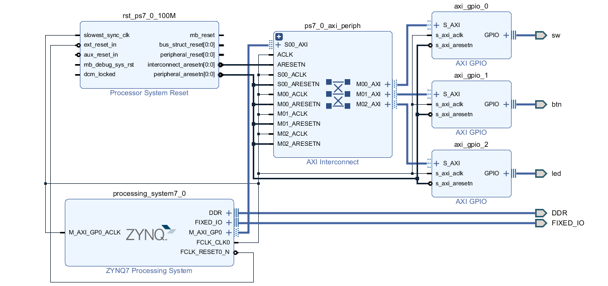
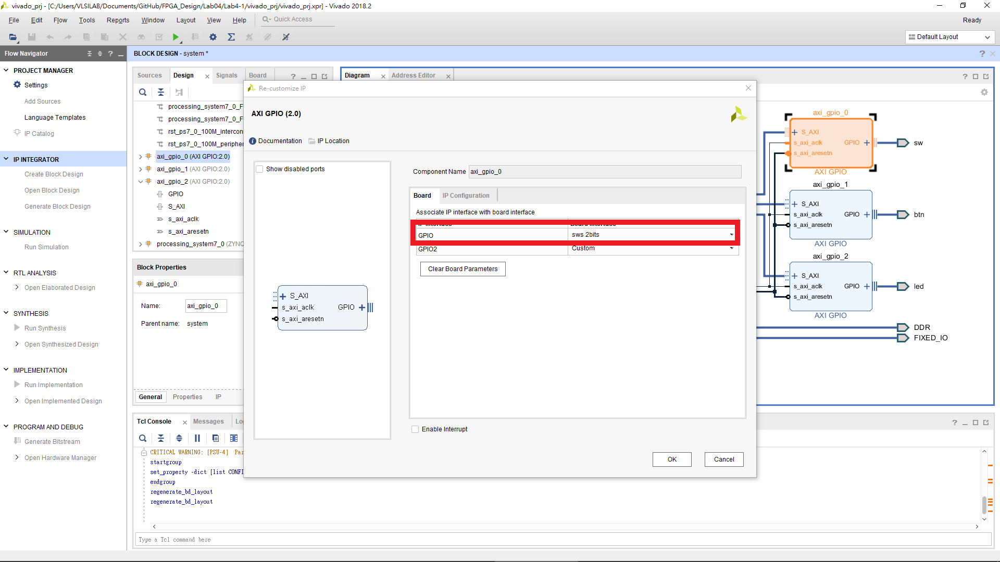
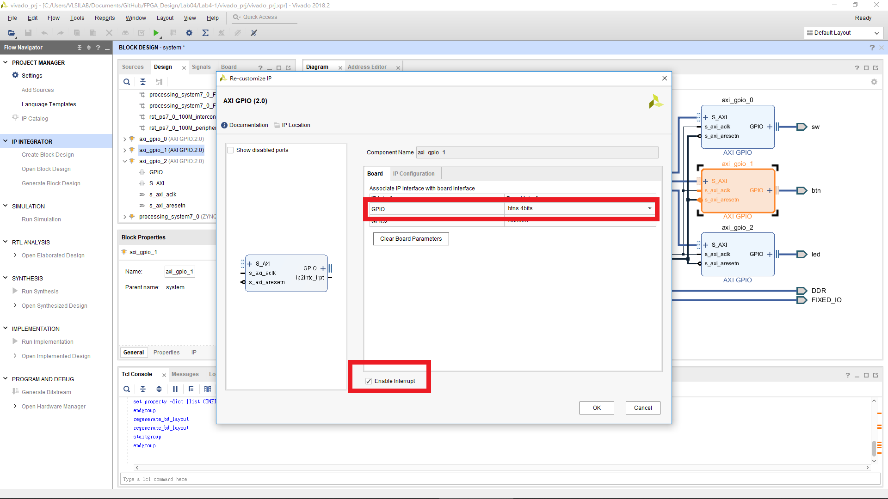
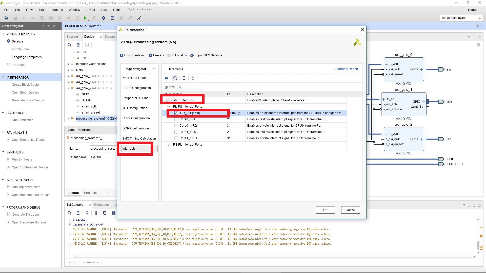
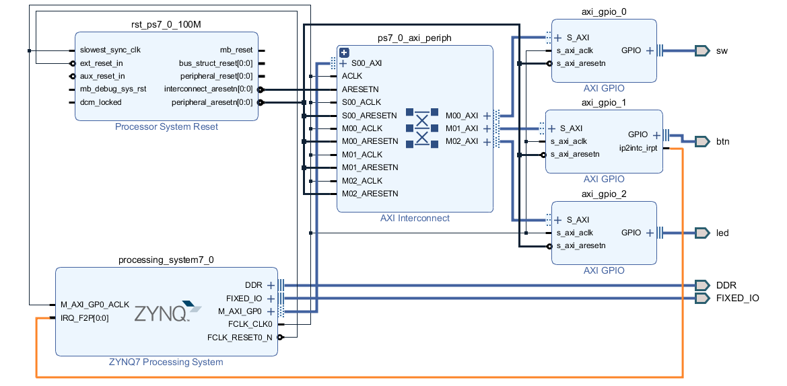

FPGA Design Lab4-1
=================

## Step 1. Block design

本次實驗的 block design 如下圖所示。

下兩張圖為 AXI GPIO Board Interface 的設定，第三個 AXI GPIO 與 Lab3-2 LED 的設定相同。

本次實驗會使用到 interrupt，因此需啟用 processor 的 interrupt。

將 btn 啟用的 interrupt 接到 processor，形成此次實驗的 block design。

## Step 2. Write a software program

開啟 SDK。  

請回顧 [Lab3-2](https://github.com/ncku-vlsilab/FPGA_Design/tree/master/Lab03/Lab3-2#step-5-write-a-leds-control-program)，載入檔案改為 `Lab4-1/src/gpio_irq.c`
