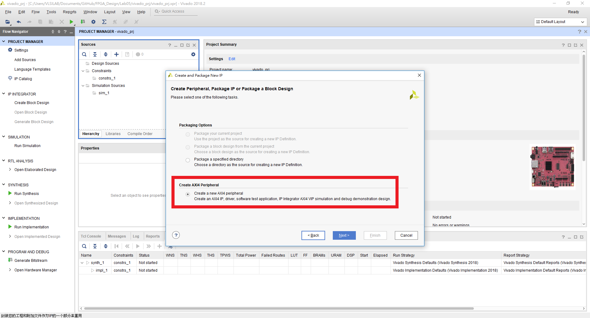
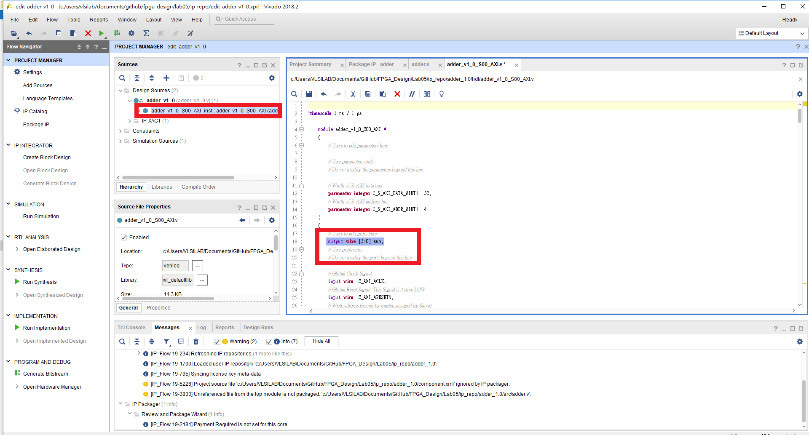
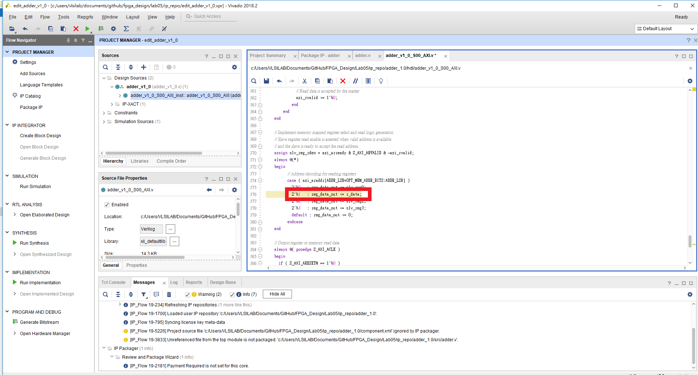
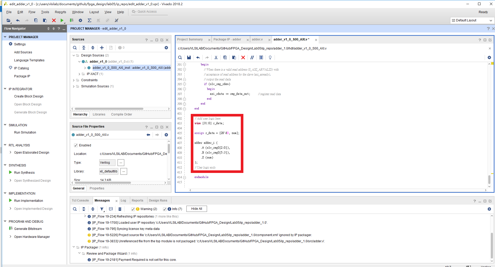
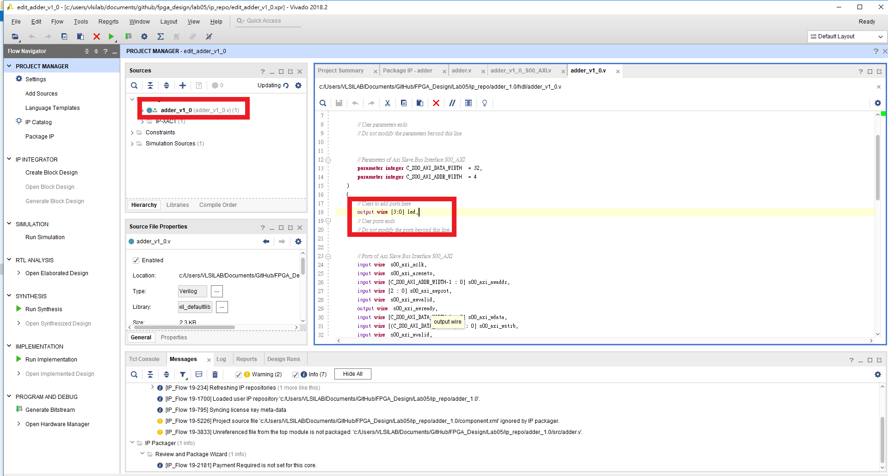
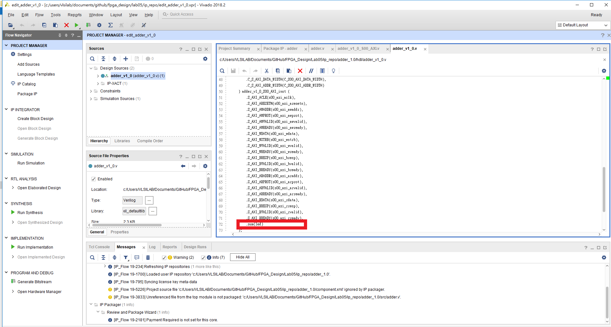
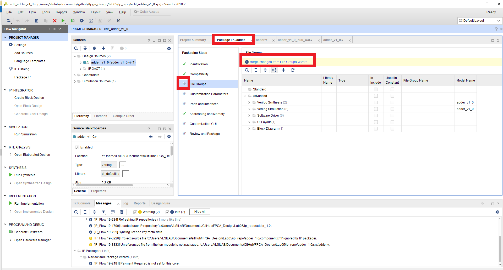
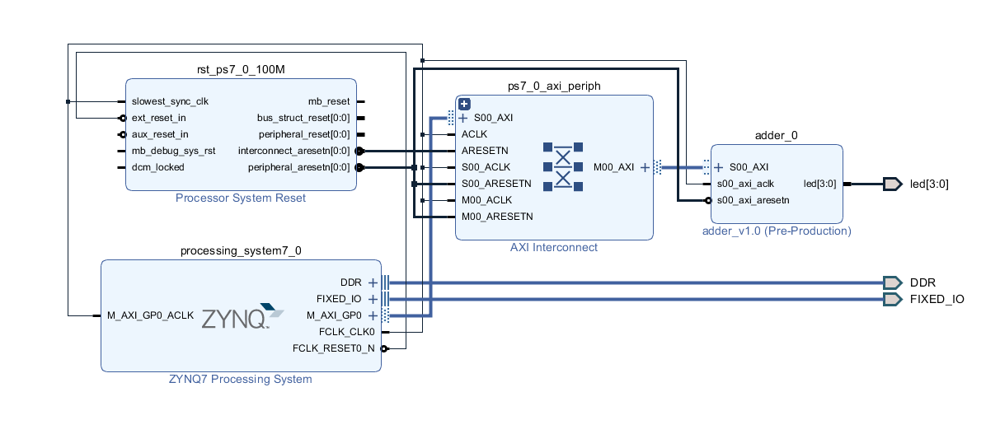
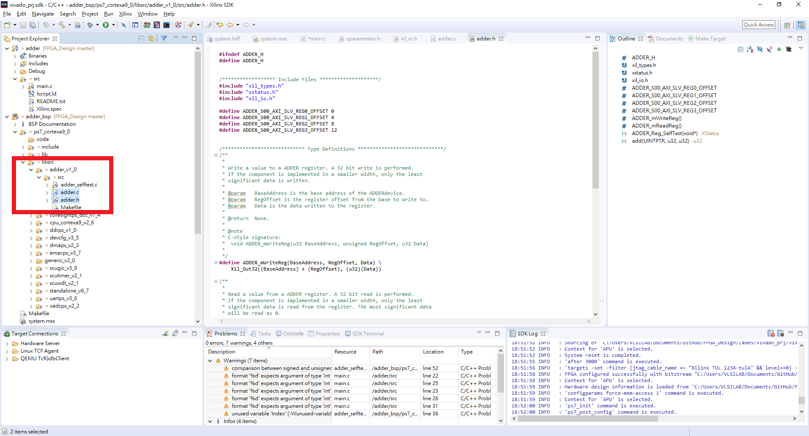

FPGA Design Lab05 -- Package a Custom AXI IP
=================

## Step 1. Create a new project
請回顧 [Lab01 Step1](https://github.com/ncku-vlsilab/FPGA_Design/tree/master/Lab01#step-1-create-a-new-project)，無需加入任何檔案。
## Step 2. Create new IP
回憶 [Lab2-2 step3](https://github.com/ncku-vlsilab/FPGA_Design/tree/master/Lab02/Lab2-2#step-3-package-the-frequency-divider-ip)

不同於 Lab2-2 選擇 Create a new AXI4 peripheral，最後選擇 Edit IP。

  

創建完後加入`src/hdl/adder.v`，並修改產生的 HDL code。

  

HDL code 修改完後，回到 package IP 畫面將沒有打勾的部分點進去修改，最後 Package IP。

回到 create new IP 前的 project，refresh 加入的 IP。

本次實驗的 Block design。

## Step 3. Write user IP driver and software program

請回顧 [Lab3-2](https://github.com/ncku-vlsilab/FPGA_Design/tree/master/Lab03/Lab3-2#step-5-write-a-leds-control-program)，載入檔案改為 `src/software/main.c`

將 `src/driver/` 內的程式複製到下圖紅色部分。

