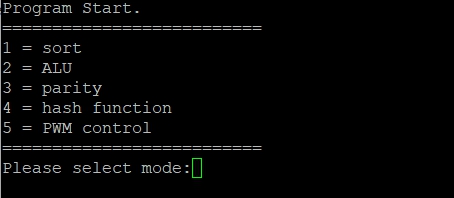
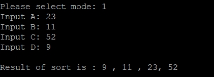
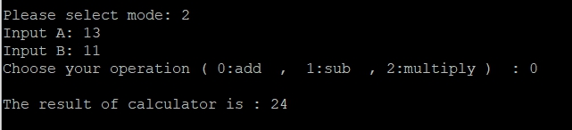
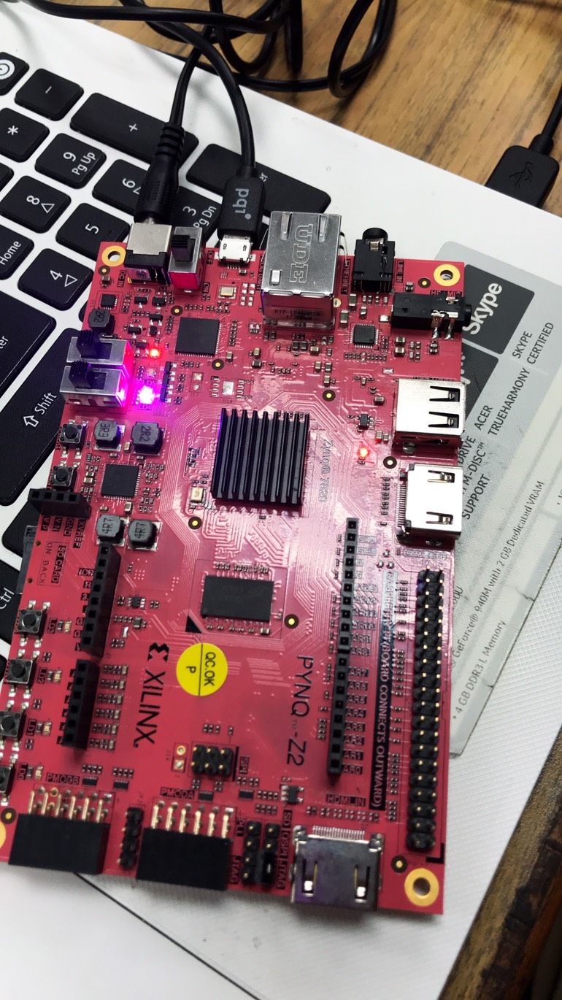

# Homework 5 
## Member

E24056580
E24045173
E24053037

##  Program 
開啟程式之後，先按一下Enter鍵確定啟動程式。
接著會顯示以下選項：

以下分別說明這五種功能及其輸入
1. sorting 	
- 用途：用以排列4個int數據
- 需依A、B、C、D順序
		依照指示輸入想排列的四個整數
		(不可一次四個全輸入)
		輸入後程式及輸出排序結果，如下圖所示

2. calculator
- 用途：可將2個int數據做加、減、乘法運算
- 先依照指示分別輸入數字
接著，輸入想進行的運算
0代表加法  ,  1表減法  , 2是乘法		**(勿直接輸入"+" "-" "*")**

3. parity
- 可算出一個int數值的parity bit
- 直接輸入一個數字即可
	

	
4. hash
- 可算出一個4位元string輸入(4 byte)經由djb2演算法後得到的結果，
- 由於是4byte的字串，
		**切記輸入只能有"四個"字元！**
		(EX : abcd 、16ad)
- p.s.輸出的結果為十進位輸出

5. PWM control
- 可以控制FPGA上LED燈的輸出顏色
- 首先要輸入是否reset這個controller內所存的檔案
		1為刷新，0則否
		但後來發現這步驟根本不需要所以隨便輸入即可
- 接著分別輸入想調整的RGB值 (0~255)

