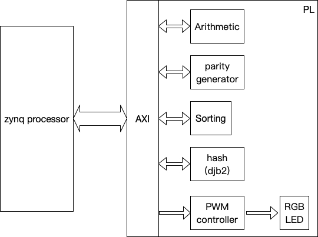

Homework
====

## 繳交時間
2018/12/2 23:59

請將以下電路同整在一個 block design，並且每個 ip 都要上傳且都要有 ooc (IP 怎能沒有先合成過呢)，請勿只交 hdl code。

### Program 1.

設計一個排序電路，由 processor 輸入一串數字將其排序後傳回。(數列長度固定)

### Program 2.

設計一個計算電路，由 processor 輸入運算子與運算元並回傳運算完的結果。(加, 減, 乘)

### Program 3.

設計 parity generator，輸入 32-bit 資料回傳其 parity bit (**禁止額外暫存器的使用 ex: counter**)。

### Program 4.

設計 [djb2](http://www.cse.yorku.ca/~oz/hash.html) 這個 hash function 的電路。

### Program 5.

設計 PWM controller。

可參考 [Creating a Custom IP core using the IP Integrator ](https://reference.digilentinc.com/learn/programmable-logic/tutorials/zybo-creating-custom-ip-cores/start?redirect=1)。

### Block Diagram

