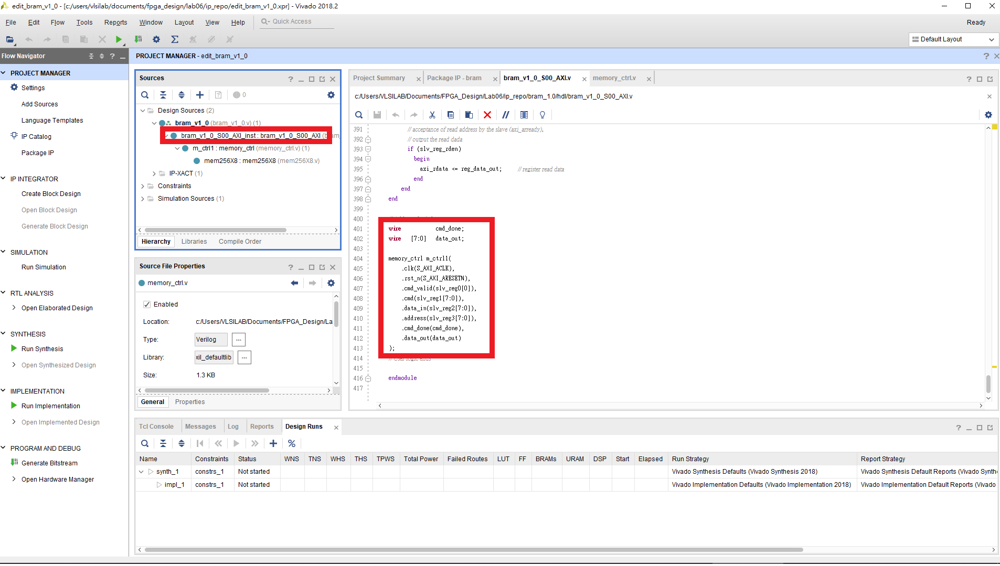
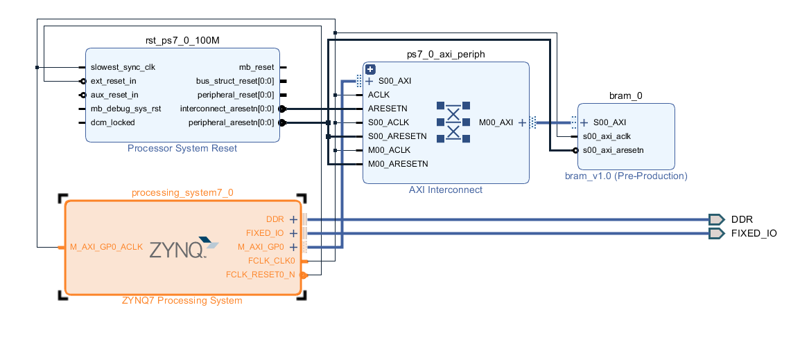
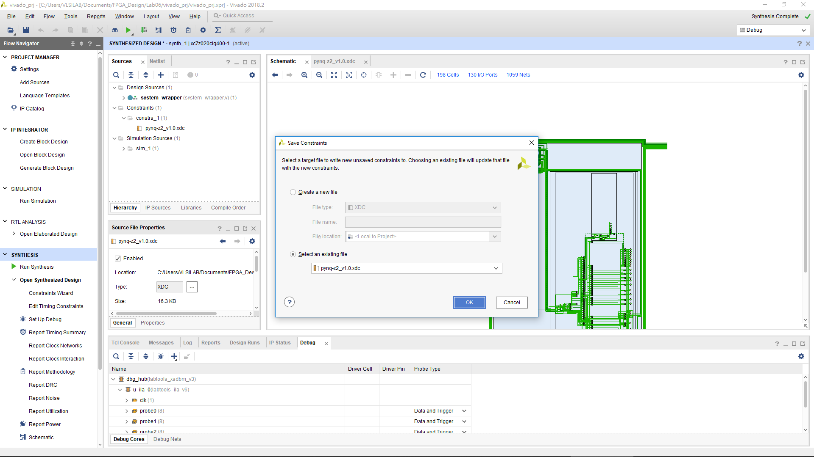
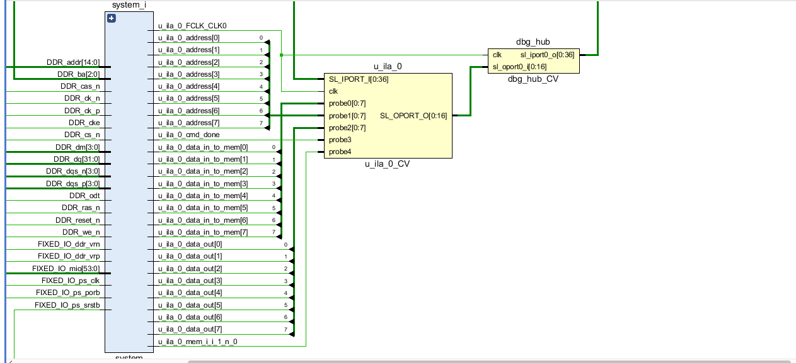
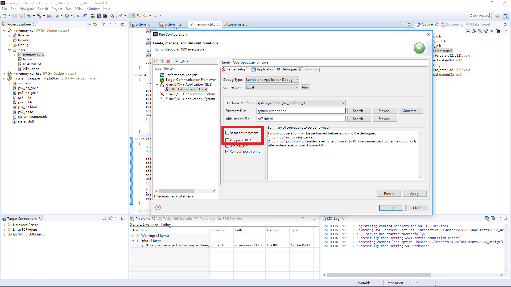
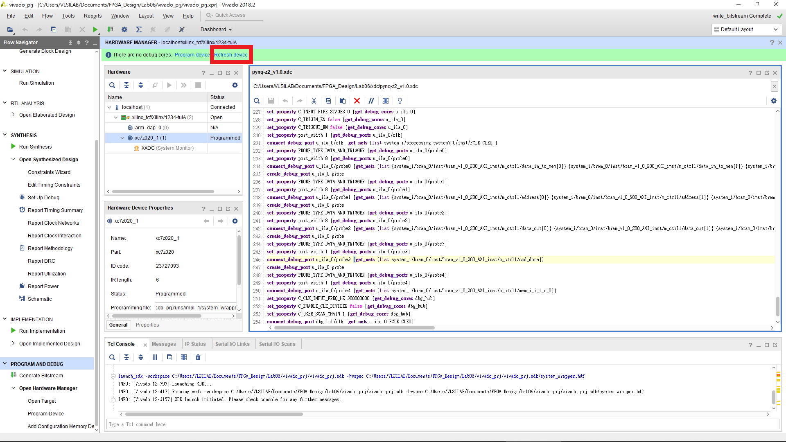
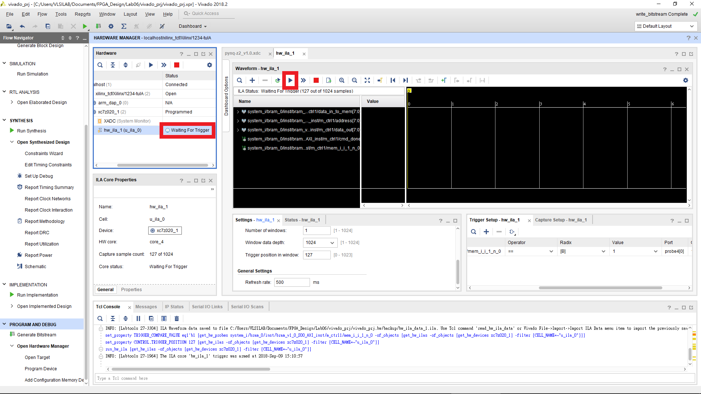

FPGA Design Lab05 - Block RAM and Hardware Debugger
=================
## Purpose

本次實驗讓各位學習如何使用 FPGA 上的 Block RAM 以及如何使用 Hardware Debug 來檢查我們設計的電路行為是否符合我們的要求。

## Package AXI IP
請回顧 Lab5 的教學。本次實驗要將 `hdl/memory_ctrl.v hdl/mem256X8.v` 包成 AXI IP。修改 IP 內的 `YourIPName_S00_AXI.v` 如下圖。

  

  

## Block design

本次實驗的 Block Design 如下圖。

## Set up debug
本次實驗需多加入 debug 的步驟。

 Create HDL Wrapper 後執行 Run Synthesis。等待 synthesis 結束後點開 schemetic 會出現如下圖。

展開 schemetic 裡的 block 找到我們設計的 memory。為了能看到 memory 的 `data_in data_out address write_enable cmd_done` 這些輸出入的波形，選取這些連接的線右鍵選擇 Mark Debug，之後這些線上便會出現綠色的蟲，如下圖。

按下 Set Up Debug 後可看到剛剛選擇的線，finish。

儲存加入 debug 的 schemetic，這步驟會需加入新的 constraints，在這我們將新的 constraints 加入到原本的 constraint file，如下圖。

儲存完後重新開啟 schemetic 會發現多了兩個 blocks 如下圖，這兩個 blocks 就是 debug module。

## Generate bitstream

執行 Generate Bitstream，等待完成後到 Project Summary 介面看 Implementation 後的結果，會發現我們有使用到 FPGA 上的 BRAM。

## Program device

Open Target > Program Device

## Launch SDK

Export Hardware (include bitstream) > Launch SDK

[Create Application Project](https://github.com/ncku-vlsilab/FPGA_Design/tree/master/Lab03/Lab3-1#step-6-write-a-hello-world-program) > 加入 `src/memory_ctrl.c`

## Hardware debug

由於在前面我們已經將我們的設計好的電路燒錄到 FPGA，因此在執行 Run Configuration 時不需勾選 Program FPGA。

等待執行完畢後，回到 Vivado 畫面選擇 Refresh device。

Refresh 完後會出現如下圖的畫面，這時會看到有我們剛剛有設定 Debug 的那些線，點開右下腳的加號。我們希望當 write enable 為 1 時會記錄下波形並顯示出來。

中間紅色框起來的部分為設定當遇到右邊設定好的 Trigger 訊號時，會顯示前後多少個 cycle 的波形。

設定完後，由於此時我們還沒開始偵測訊號，因此會看到右邊會顯示 idle。

按下 Run Trigger 後，原本顯示 idle 會變成 waiting for trigger。這時再回到 SDK 再次執行 Run Configuration。

等待程式執行完畢後回到 Vivado 畫面便會看到有波形出現。檢查一下這些值是否符合我們期望的結果。

