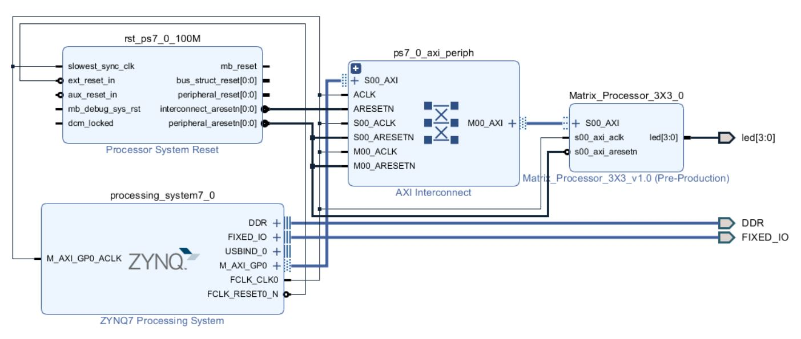
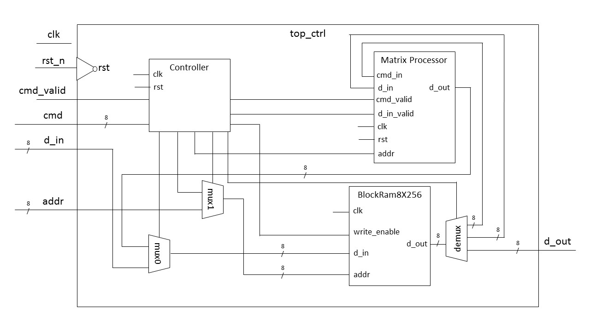
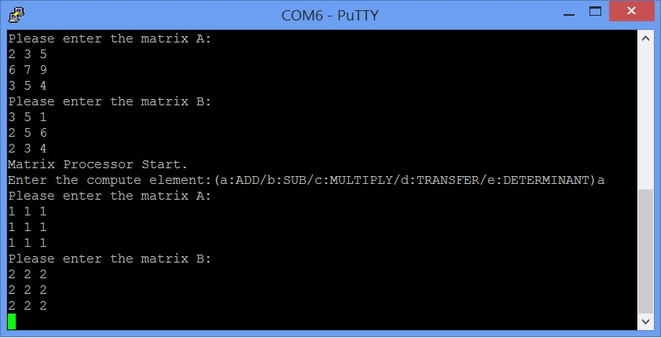

# FPGA-based System Design - Lab06 HW
## 成員名單
E24046357、E24046399、E24042060
## 作業需求：設計一個矩陣運算的處理器，可做乘法，加法，減法，轉置，行列式運算
1.  矩陣運算處理器的指令及資料僅能透過 BRAM 存取。
2.  自行分配 BRAM 中存放指令及資料的位址，並要在 README 告知分配的位址。
## Block Design

## IP架構圖

**註：這次的作業我們交的是屍體，硬體部分使用testbench驗證是可以正常運算的，但使用SDK的指令來控制卻無法和預想一樣執行，但我們還是詳盡說明我們設計的想法。**

### 設計說明
我們設計一個FSM來控制Block Ram(**以下簡稱mem**)以及Matrix Processor(**以下簡稱pro**)，狀態如下：

| 狀態 | 說明 |
|--|--|
| RESET | 重置，根據PS端給的cmd來決定下一個狀態，cmd_valid為high時會跳至WRITE/SEND/COMP/SEND_B/READ，若cmd_valid為low則會跳至WAIT |
| WAIT | 等待cmd_valid變為high後，變為下一個狀態；若cmd_valid仍為0 |
| WRITE | 將資料根據SDK給的address寫入mem；mux0使mem的d_in選擇AXI的d_in；mux1使mem的addr選擇AXI的addr |
| SEND | 根據這次運算的運算元，將資料從mem傳至pro；demux使mem的d_out選擇pro的cmd_in以及d_in；mux1使mem的addr選擇Controller內部counter給的addr |
| COMP | 留一段時間讓pro運算 |
| SEND_B | 將運算完的結果從pro寫回mem；mux0使mem的d_in選擇mem的d_out；mux1使mem的addr選擇Controller內部counter給的addr |
| READ | 將資料根據SDK給的address從mem讀出來；demux使mem的d_out選擇硬體的d_out；mux1使mem的addr選擇AXI的addr |
| DONE | 在WRITE/SEND/COMP/SEND_B/READ這幾個狀態做完後，皆會跳至DONE，使cmd_done為1，告訴PS端這次的cmd做完了 |

### Block Ram 說明

| Address | Contents |
|--|--|
| 0 | 運算元 (加法:1/減法:2/乘法:3/轉置矩陣:4/行列式運算:5) |
| 1~9 | 運算子A矩陣 |
| 10~18 | 運算子B矩陣 |
| 19~27 | 運算結果C矩陣(若運算元為行列式運算，結果則只會存在第19格) |

### 軟體端說明
在程式開始後會先要求使用者輸入運算元，根據運算元決定輸入資料的數量
若為**加法/減法/乘法**，則會要求使用者輸入兩個矩陣。
若為**轉置矩陣**及**行列式運算**，則只會要求使用者輸入一個矩陣。
輸入結束後將資料一次寫入Block Ram以後，再依序輸入cmd為SEND、COMP、SNED_BACK
最後再根據運算元讀出Block Ram的資料，顯示在PuTTY上。
如圖：

## 問題檢討

1. PS端給的cmd與FSM預期的cmd無法在預期的時間對上，導致FSM的狀態沒有照理想的排程去跳。

2. 沒有徹底了解AXI interface在運作時的各個訊號的意義、以及運作流程(如S_AXI_ARESETN)，使我們根本不確定整個電路到底有沒有從RESET的狀態開始運作。

> Written with [StackEdit](https://stackedit.io/).
