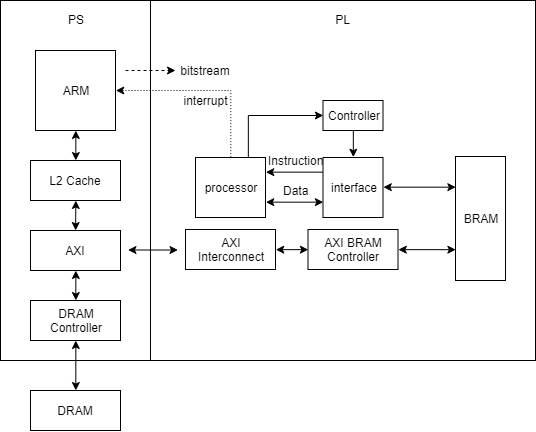

Homework
====

## 繳交時間
2018/12/16 23:59

請務必上傳產生的 bitstream (也就是 `.bit`)，你們寫的 driver，及測試用的 Code，以方便我們評分。

自己做的 IP 一樣要有 OOC。

請勿只交 hdl code。

### PS 內長什麼樣子?

### Program 1.

設計一個矩陣運算的處理器，可做乘法，加法，減法，轉置運算，系統架構如下。

1. 矩陣運算處理器的指令及資料僅能透過 BRAM 存取。

2. 自行分配 BRAM 中存放指令及資料的位址，並要在 README 告知分配的位址。

3. 矩陣運算處理器運算完後，啟動中斷訊號告知 ARM 存取 BRAM 中的運算結果。 (非必要)

可參考 [BRAM 的使用](https://blog.csdn.net/u014485485/article/details/78882027)。
